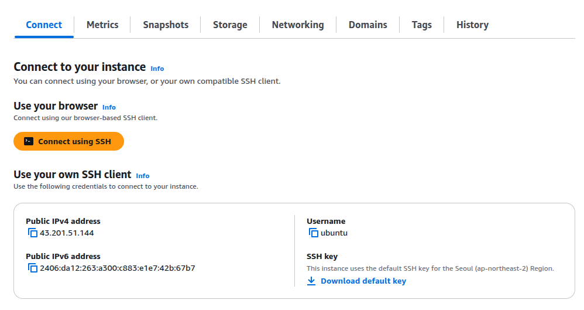

# AWS Lightsail : Pybo + Nginx + Gunicorn 배포

- pybo 저장소: [https://github.com/SCKIMOSU/pybo.git](https://github.com/SCKIMOSU/pybo.git)

---

## ✅ 전체 개요

- 서버: AWS Lightsail (Ubuntu 22.04)
- WSGI 서버: Gunicorn
- Reverse Proxy: Nginx
- Django 앱: pybo (GitHub에서 clone)
- 기타: 가상환경 사용, `ALLOWED_HOSTS`, 정적 파일 설정

---

## ✅ 1. Lightsail 인스턴스 생성 및 접속

1. Lightsail 접속 → Ubuntu 서버 생성
2. 생성 후 "연결 → SSH 터미널 열기" 또는 로컬에서:

```bash
ssh -i LightsailDefaultKey.pem ubuntu@43.201.51.144

```

---

- Lightsail에서 SSH를 이용 서버 접속
    
    
    

---

## ✅ 1. 접속 방법 요약

### 🔹 A. **Lightsail 웹 콘솔에서 직접 SSH 접속 (간단)**

1. [https://lightsail.aws.amazon.com/](https://lightsail.aws.amazon.com/) 접속
2. 인스턴스 선택
3. **"연결"** 탭 클릭
4. **브라우저 기반 SSH 터미널** 사용 (별도 설정 없이 가능)

---

### 🔹 B. **로컬 PC(리눅스/macOS/WSL)에서 SSH 키로 접속**

### ① 키 파일 다운로드 (예: `LightsailDefaultKey-ap-northeast-2.pem`)

- Lightsail 콘솔 > 계정 메뉴 > SSH 키 > 다운로드
- 해당 키를 안전한 위치에 저장

### ② 키 파일 권한 설정

```bash
chmod 400 LightsailDefaultKey-ap-northeast-2.pem

```

### ③ SSH 접속

```bash
ssh -i LightsailDefaultKey-ap-northeast-2.pem ubuntu@<인스턴스_IP>

```

예시:

```bash
ssh -i LightsailDefaultKey-ap-northeast-2.pem ubuntu@43.201.51.144

```

---

### 🔹 C. **Windows 사용자라면 PuTTY로 접속 (pem → ppk 변환 필요)**

1. `.pem` 파일을 **PuTTYgen**으로 `.ppk` 변환
2. PuTTY에서 IP 입력 + `.ppk` 키 파일 등록
3. 접속

---

## ✅ 접속 안 될 때 점검 체크리스트

| 항목 | 확인 방법 |
| --- | --- |
| 인스턴스 실행 중인지 | Lightsail 콘솔에서 상태 확인 |
| 공인 IP 맞는지 | 콘솔 > 인스턴스 > 네트워킹 탭 |
| 방화벽에서 SSH(포트 22) 허용 중인지 | "네트워킹" > 포트 열림 여부 확인 |
| 키 파일 권한 400인지 | `chmod 400` |
| 키 파일 경로가 정확한지 | `ls -l` 로 경로 확인 |

---

- **접속된 Lightsail 웹 콘솔**


## ✅ 2. 필수 패키지 설치

```bash
sudo apt update
sudo apt install python3-pip python3-venv nginx git -y

```

---


## ✅ 3. 프로젝트 다운로드 및 가상환경 구성

```bash
cd ~
git clone https://github.com/SCKIMOSU/pybo.git
cd pybo
python3 -m venv venv
source venv/bin/activate
pip install --upgrade pip
pip install -r requirements.txt

```

---


## ✅ 4. Django 설정 변경

**`pybo/config/settings.py`**

```python
DEBUG = False

ALLOWED_HOSTS = ['YOUR_DOMAIN_OR_IP', 'localhost', '127.0.0.1']

STATIC_URL = '/static/'
STATIC_ROOT = BASE_DIR / 'staticfiles'

```


- **추가 권장: SECRET_KEY 환경변수 처리**

```python
import os
SECRET_KEY = os.environ.get('DJANGO_SECRET_KEY', 'insecure_key_for_dev')

```

---

## ✅ 5. 정적 파일 수집 및 DB 마이그레이션

```bash
python manage.py collectstatic
python manage.py migrate

```

---

- pip install django 로 django를 설치하고  python manage.py collectstatic 명령어를 실행함
- python manage.py migrate 실행하여 database를 생성함


## ✅ 6. Gunicorn 설정

```bash
# 테스트 실행
gunicorn --bind 127.0.0.1:8000 config.wsgi

```

- **정상 작동 시 `Ctrl+C` 로 종료 후 systemd 서비스 구성**

---

## ✅ 7. Gunicorn systemd 서비스 파일 생성

```bash
sudo nano /etc/systemd/system/gunicorn.service

```

```
[Unit]
Description=Gunicorn daemon for pybo
After=network.target

[Service]
User=ubuntu
Group=www-data
WorkingDirectory=/home/ubuntu/pybo
ExecStart=/home/ubuntu/pybo/venv/bin/gunicorn --access-logfile - --workers 3 --bind unix:/home/ubuntu/pybo/pybo.sock config.wsgi:application

[Install]
WantedBy=multi-user.target

```

```bash
sudo systemctl start gunicorn
sudo systemctl enable gunicorn

```

---


## ✅ 8. Nginx 설정

```bash
sudo nano /etc/nginx/sites-available/pybo

```

```
server {
    listen 80;
    server_name YOUR_DOMAIN_OR_IP;

    location = /favicon.ico { access_log off; log_not_found off; }

    location /static/ {
        root /home/ubuntu/pybo;
    }

    location / {
        include proxy_params;
        proxy_pass http://unix:/home/ubuntu/pybo/pybo.sock;
    }
}

```


```bash
sudo ln -s /etc/nginx/sites-available/pybo /etc/nginx/sites-enabled
sudo nginx -t
sudo systemctl restart nginx

```

---

- 심볼릭 링크가 파일 존재하면 존재한다고 알려 줌


## ✅ 심볼릭 링크란?

> 심볼릭 링크는 원본 파일의 경로를 담고 있는 얇은 껍데기
> 
> 
> 링크를 열면 실제 원본 파일이 열림
> 
> ## `심볼릭 링크 (symbolic link, symlink)`
> 
> - **다른 파일이나 디렉토리에 대한 "참조(바로가기)" 파일**
>     - **Windows의 "바로가기 아이콘"** 과 비슷

---

### 📌 예시

```bash
ln -s /home/ubuntu/원본.txt 링크.txt

```

- `링크.txt`는 실제로 존재하지 않으며
- `원본.txt`를 가리키는 "가상 파일"
- `cat 링크.txt` 하면 실제 `원본.txt` 내용이 출력됨

---

## ✅ 심볼릭 링크 vs 하드 링크 비교

| 항목 | 심볼릭 링크 (`ln -s`) | 하드 링크 (`ln`) |
| --- | --- | --- |
| 독립성 | 원본 삭제 시 깨짐 ❌ | 원본 삭제해도 유지됨 ✅ |
| 크기 | 아주 작음 (경로만 저장) | 실제 파일과 동일 |
| 디렉토리 링크 가능 여부 | 가능 ✅ | 불가 ❌ (일반적으로) |
| 파일 시스템 경계 넘기기 | 가능 ✅ | 불가 ❌ |
| 용도 | 설정 연결, 바로가기 등 | 동일한 파일 다중 이름 |

---

### 📂 Nginx에서 왜 쓰는가?

- `/etc/nginx/sites-available/` → 설정 파일 저장소
- `/etc/nginx/sites-enabled/` → 실제 적용할 설정 모음

```bash
sudo ln -s /etc/nginx/sites-available/pybo /etc/nginx/sites-enabled/

```

→ `sites-enabled/pybo` 는 원본 파일을 그대로 가리킴

→ `nginx.conf`는 `/etc/nginx/sites-enabled/*` 를 include 하므로, 설정이 반영됨

---

## ✅ 확인 방법

```bash
ls -l

```

출력 예:

```
pybo -> ../sites-available/pybo

```

→ `pybo`는 symlink이며 `../sites-available/pybo`를 가리킴

---

## ✅ 삭제도 안전하게 가능

- 링크만 삭제:

```bash
sudo rm /etc/nginx/sites-enabled/pybo

```

→ 원본 파일은 **절대 삭제되지 않음**

---

## ✅ 9. 방화벽 설정 (Lightsail)

- Lightsail 콘솔 → 네트워킹 → 포트 80, 443, 22 열기
    - Lightsail 네트워킹 화면


---

## ✅ 10. 도메인 연동 (선택)

- 도메인이 있다면 A 레코드 → Lightsail IP로 연결
- `server_name` 항목에 도메인 입력

---

## ✅ 11. HTTPS 설정 (선택, Let’s Encrypt)

```bash
sudo apt install certbot python3-certbot-nginx -y
sudo certbot --nginx -d YOUR_DOMAIN

```

---

## ✅ 12. 검증

브라우저 접속:

```
http://<YOUR_PUBLIC_IP>
또는
http://<YOUR_DOMAIN>

```

---

## ✅ 자주 발생되는 문제

- `502 Bad Gateway`: Gunicorn이 제대로 작동 중인지 확인
- `Permission denied`: `pybo.sock`의 권한 (`www-data` 그룹 포함) 확인
- 정적 파일 안 뜰 때: `STATIC_ROOT`, `collectstatic`, `root` 경로 재확인

---

## ✅ 완성된 서비스 구조 요약

```
[ Client ] → HTTP → [ Nginx (80) ]
                        ↓ proxy_pass
                [ Gunicorn (UNIX Socket) ]
                        ↓
                [ Django app (pybo) ]

```

---

- 실행 화면
    - 파이보 서비스가 AWS **43.201.51.144 (외부 서버)에서 동작중**


## AWS **43.201.51.144 (외부 서버)에서 동작중**

- `43.201.51.144`는 AWS Lightsail에서 발급받은 공인 IP 주소(Public IP address)이므로, AWS **43.201.51.144 (외부 서버)에서 동작중**

---

## ✅ 정리

| 표현 | 설명 |
| --- | --- |
| 외부 서버 (external server) ✅ | **당신이 아닌 제3자 또는 인터넷 사용자들이 접속할 수 있는 서버**라는 의미에서 올바른 표현 |
| 공인 IP (public IP) ✅ | 인터넷 상에서 유일하며, **어디서든 접근 가능한 IP 주소** |
| 원격 서버 (remote server) ✅ | **내 로컬이 아닌, 네트워크를 통해 접근하는 서버**라는 의미에서 정확한 표현 |
| 퍼블릭 호스트 ✅ | 퍼블릭 IP를 가진 호스트, Nginx나 Django 웹앱이 서비스되는 대상 |
| 클라우드 서버 ✅ | AWS Lightsail은 클라우드 환경에서 운영되므로 정확한 표현 |

---

## ❗주의 (내부 서버와의 구분)

| 용어 | 예시 IP | 의미 |
| --- | --- | --- |
| 외부 서버 | `43.201.51.144` | 퍼블릭 인터넷에서 접근 가능 |
| 내부 서버 | `192.168.x.x`, `172.16.x.x`, `10.x.x.x` | 로컬 네트워크 내 전용 IP (외부 접속 불가) |

---

- 43.201.51.144는 외부 서버, 공인 IP를 가진 원격 서버, AWS Lightsail 클라우드 인스턴스
    - → 따라서 `"외부 서버에 pybo를 배포했다"` 또는 `"공인 IP 43.201.51.144를 통해 서비스 중이다"` 라고 말할 수 있음

---

## ssh -i LightsailDefaultKey-ap-northeast-2.pem [ubuntu@43.201.51.144](mailto:ubuntu@43.201.51.144) 접속 안 될 때

- `ssh -i LightsailDefaultKey-ap-northeast-2.pem ubuntu@43.201.51.144` 명령어로 AWS Lightsail 인스턴스에 접속이 안 되는 경우,
    - 우분투 터미널에서 Lightsail ssh 접속

---

## ✅ 1. 키 파일 경로 및 권한 확인

```bash
ls -l LightsailDefaultKey-ap-northeast-2.pem

```

- 파일이 현재 디렉터리에 없거나 이름이 틀리면 "No such file" 오류 발생
- 권한 확인

```bash
chmod 400 LightsailDefaultKey-ap-northeast-2.pem

```

> 🔒 퍼미션이 400이 아니면 SSH에서 거부됨 (보안상 제한)
> 

---

## ✅ 2. IP 주소 확인

- Lightsail 콘솔에서 해당 인스턴스의 **공인 IP (Public IP)** 가 `43.201.51.144`가 맞는지 다시 확인
    - 콘솔에서 해당 인스턴스를 선택 → "연결" → "공용 IP" 확인
    - IP 주소가 바뀔 수 있으니 재확인 필수

---

## ✅ 3. SSH 포트가 열려 있는지 확인 (Lightsail 방화벽 설정)

- Lightsail > 네트워킹 > 인스턴스 > 방화벽 탭에서 아래 설정이 있는지 확인:

| 프로토콜 | 포트 | 허용 대상 |
| --- | --- | --- |
| SSH | 22 | 0.0.0.0/0 |

---

## ✅ 4. 인스턴스가 켜져 있는지 확인

- Lightsail 콘솔에서 인스턴스 상태가 **"정상 실행 중"** 인지 확인

---

## ✅ 5. 연결 예시 전체 (현재 디렉터리에 pem 파일 있을 경우)

```bash
ssh -i ./LightsailDefaultKey-ap-northeast-2.pem ubuntu@43.201.51.144

```

---

## ✅ 6. 오류 메시지 분석 (필요시 전체 출력 공유)

접속 시 나오는 **오류 메시지 전체**를 복사해서 보내주시면, 어떤 단계에서 막히는지 정확히 분석 가능합니다.

예:

- `Permission denied (publickey)`
- `Connection timed out`
- `No such file or directory`
- `WARNING: UNPROTECTED PRIVATE KEY FILE!`

---

## nginx는 `requirements.txt`에 **포함하지 않음**

- `requirements.txt`: `pip install`로 설치하는 **Python 라이브러리 목록**
- `nginx`: Python과 관련 없는 **시스템 웹서버 소프트웨어** → `apt`로 설치
- `requirements.txt`는 Python 패키지를 설치하는 용도로 사용되며, `nginx`는 **Python 패키지가 아니라 리눅스 시스템 패키지**

---

### ✅ Ubuntu에서 nginx 설치:

```bash
sudo apt update
sudo apt install nginx -y

```

---

## ✅ pybo 프로젝트의 requirements.txt 예시 (nginx 제외)

```
Django>=4.0,<5.0
gunicorn>=20.1.0        # Python WSGI 서버
markdown                # 질문/답변 포맷팅에 사용될 수 있음
django-crispy-forms     # 폼 스타일링 (선택)
python-dotenv           # 환경변수 관리 (선택)

```

- nginx는 여기에 절대 포함되지 않음.

---

## ✅ 추가로 필요한 시스템 패키지 정리 (nginx 관련)

| 역할 | 설치 명령어 |
| --- | --- |
| Nginx 설치 | `sudo apt install nginx -y` |
| Gunicorn 서비스 구성 | `pip install gunicorn` |
| 가상환경 준비 | `python3 -m venv venv` |

---

## ✅ 결론

- `nginx`는 `pip`로 설치 ❌
- `requirements.txt`에 포함 ❌
- 대신 `apt install nginx`로 설치 ✅

---

## sudo systemctl start gunicorn 명령어 에러시

```jsx
(venv) ubuntu@ip-172-26-0-96:~/pybo$ sudo systemctl start gunicorn
**Failed** to start gunicorn.service: **Unit gunicorn.service has a bad unit file setting.**
See system logs and 'systemctl status gunicorn.service' for details.
```

- `gunicorn.service` 파일 설정 오류로 인해 `sudo systemctl start gunicorn` 명령이 실패.
- 오류 메시지: `Unit gunicorn.service has a bad unit file setting.`

---

## ✅ 해결 절차

### 1️⃣ 현재 서비스 파일 내용 확인

- 아래 명령어로 설정 내용을 확인

```bash
sudo cat /etc/systemd/system/gunicorn.service

```

---

### 2️⃣ 올바른 예시: gunicorn.service

```
[Unit]
Description=Gunicorn daemon for pybo
After=network.target

[Service]
User=ubuntu
Group=www-data
WorkingDirectory=/home/ubuntu/pybo
ExecStart=/home/ubuntu/pybo/venv/bin/gunicorn --access-logfile - --workers 3 --bind unix:/home/ubuntu/pybo/pybo.sock config.wsgi:application

[Install]
WantedBy=multi-user.target

```

- ⚠️ WorkingDirectory, ExecStart 경로가 실제 존재하는지 꼭 확인하세요.

---

### 3️⃣ 수정 후 작업 순서

1. 파일 수정:
    
    ```bash
    sudo nano /etc/systemd/system/gunicorn.service
    
    ```
    
2. systemd 리로드:
    
    ```bash
    sudo systemctl daemon-reexec
    sudo systemctl daemon-reload
    
    ```
    
3. Gunicorn 실행:
    
    ```bash
    sudo systemctl start gunicorn
    sudo systemctl status gunicorn
    
    ```
    

---

### ✅ 로그 확인 (에러 원인 자세히 보기)

```bash
journalctl -xe

```

→ 해당 로그에 `gunicorn.service` 관련 오류 메시지가 나옵니다.

---

## 🛠️ 자주 발생하는 오류 예시

| 원인 | 메시지 예시 |
| --- | --- |
| 잘못된 경로 (`ExecStart`) | `No such file or directory` |
| 오타 (예: `ExceStart`) | `bad unit file setting` |
| `User=ubuntu`인데 존재 안함 | `Failed to determine user credentials` |
| `WorkingDirectory` 경로 없음 | `chdir() to /home/... failed: No such` |

---

---

## 🧙‍♂️ 데몬(daemon)이란?

> 데몬(daemon) 은 백그라운드에서 지속적으로 실행되며, 특정 요청이나 작업을 처리하는 프로그램.
> 
- 사용자가 직접 실행하거나 조작하지 않아도
- 시스템이 부팅될 때 자동으로 시작되어
- **지속적으로 서비스 또는 이벤트를 대기하고 처리**.
- 리눅스/유닉스 시스템에서 매우 중요한 개념

---

## ✅ 데몬의 특징

| 특징 | 설명 |
| --- | --- |
| **백그라운드 실행** | 화면에 표시되지 않음 (터미널 차지 X) |
| **자동 시작** | 시스템 부팅 시 자동으로 실행 |
| **지속 실행** | 사용자가 종료하지 않는 한 계속 작동 |
| **서비스 제공** | 네트워크, 로그, 웹서버, 데이터베이스 등 |

---

## ✅ 데몬 이름 규칙

대부분 데몬의 이름은 **`d`로 끝남**:

| 데몬 이름 | 기능 |
| --- | --- |
| `ssh**d**` | SSH 접속을 처리 |
| `nginx` | 웹 서버 요청 처리 |
| `mysql**d**` | MySQL 데이터베이스 데몬 |
| `gunicorn` | Django 앱을 실행하는 WSGI 서버 데몬 |
| `system**d**` | 모든 시스템 서비스 관리 총괄 데몬 |

---

## ✅ 데몬이 하는 일

- **웹서버 데몬(Nginx)**
    
    → 브라우저에서 접속 요청이 오면 HTML 페이지 반환
    
- **데이터베이스 데몬(MySQLd)**
    
    → 앱이 DB 조회 요청을 하면 결과 반환
    
- **SSH 데몬(sshd)**
    
    → 원격에서 SSH 접속이 오면 로그인 처리
    
- **Gunicorn 데몬**
    
    → Django 앱을 WSGI 방식으로 처리해 웹 응답 전송
    

---

## ✅ 데몬 vs 일반 프로그램

| 항목 | 일반 프로그램 | 데몬 |
| --- | --- | --- |
| 실행 방식 | 사용자 수동 실행 | 시스템 자동 실행 |
| 터미널 점유 | 예 (`foreground`) | 아니오 (`background`) |
| 종료 방식 | 사용자 또는 Ctrl+C | `systemctl stop`, 자동종료 없음 |
| 예시 | `vim`, `python` | `sshd`, `nginx`, `gunicorn` |

---

## ✅ 데몬 실행 확인

```bash
ps aux | grep sshd

```

또는

```bash
systemctl status nginx

```

---

## 🧾 어원

- `daemon`은 고대 그리스어 **δαίμων (daimon)** 에서 유래
- 의미: **보이지 않지만 일을 수행하는 "중간 존재"**
- 컴퓨터에서는: **백그라운드에서 사용자 대신 일을 처리하는 프로그램**

---

## `systemctl`은 리눅스의 서비스 관리자 **systemd를 제어하는 명령어**

- `systemctl`은 systemd를 통해 **서버의 모든 서비스(데몬)를 시작, 중지, 재시작, 상태확인**하는 데 사용.

---

## ✅ 정의

> systemctl은 systemd를 사용하는 시스템에서 서비스 및 프로세스를 관리하는 명령어.
> 

---

## ✅ 주요 역할

| 기능 | 설명 |
| --- | --- |
| 서비스 시작 | `systemctl start` |
| 서비스 중지 | `systemctl stop` |
| 서비스 재시작 | `systemctl restart` |
| 서비스 상태 확인 | `systemctl status` |
| 부팅 시 자동실행 설정 | `systemctl enable` |
| 부팅 시 자동실행 해제 | `systemctl disable` |
| 설정 반영 (리로드) | `systemctl daemon-reload` |

---

## ✅ 자주 쓰는 명령어 예시

```bash
# 서비스 시작
sudo systemctl start gunicorn

# 서비스 중지
sudo systemctl stop nginx

# 서비스 재시작
sudo systemctl restart gunicorn

# 서비스 상태 확인
sudo systemctl status nginx

# 부팅 시 자동 실행 설정
sudo systemctl enable gunicorn

# 부팅 시 자동 실행 해제
sudo systemctl disable gunicorn

# 서비스 설정 변경 후 systemd 재로드
sudo systemctl daemon-reload

```

---

## ✅ systemctl이 관리하는 대상

- `systemctl`은 단순히 서비스만 관리하는 것이 아니라, 다음도 관리

| 대상 | 예시 |
| --- | --- |
| **서비스** (.service) | `nginx.service`, `gunicorn.service` |
| **소켓** (.socket) | `docker.socket`, `cups.socket` |
| **타이머** (.timer) | `apt-daily.timer`, `logrotate.timer` |
| **디바이스** | `dev-sda.device` |
| **마운트 포인트** (.mount) | `/mnt/backup.mount` |
| **타겟** (.target) | `multi-user.target`, `graphical.target` |

---

## ✅ 상태 확인 예시

```bash
sudo systemctl status gunicorn

```

출력 예:

```
● gunicorn.service - Gunicorn daemon for pybo
   Loaded: loaded (/etc/systemd/system/gunicorn.service; enabled)
   Active: active (running)
   Main PID: 1234 (gunicorn)

```

---

## 🔍 `systemd` vs `systemctl`

| 항목 | 설명 |
| --- | --- |
| `systemd` | 실제 서비스들을 관리하는 **백그라운드 데몬** |
| `systemctl` | systemd를 제어하는 **명령어 도구** |

---

## ✅ gunicorn.service 파일 오타 주의

```jsx
[Unit]
Description=Gunicorn daemon for pybo
After=network.target

[Services]
User=ubuntu
Group=www-data
WorkingDirectory=/home/ubuntu/pybo
ExecStart=/home/ubuntu/pybo/venv/bin/gunicorn --access-logfile - --workers 3 --bind unix:/
home/ubuntu/pybo/pybo.sock config.wsgi:application

[Install]
WanredBy=multi-user.target
```

---

## ❌ 잘못된 부분 요약

1. `[Services]` → **오타**, 올바른 섹션 이름은 `[Service]`
2. `WanredBy` → **오타**, 올바른 키는 `WantedBy`

---

## ✅ 올바르게 수정된 gunicorn.service 파일:

```
[Unit]
Description=Gunicorn daemon for pybo
After=network.target

[Service]
User=ubuntu
Group=www-data
WorkingDirectory=/home/ubuntu/pybo
ExecStart=/home/ubuntu/pybo/venv/bin/gunicorn --access-logfile - --workers 3 --bind unix:/home/ubuntu/pybo/pybo.sock config.wsgi:application

[Install]
WantedBy=multi-user.target

```

---

## 🔧 수정 방법

```bash
sudo nano /etc/systemd/system/gunicorn.service

```

---

## 🔄 수정 후 재로드 및 실행

```bash
sudo systemctl daemon-reload
sudo systemctl restart gunicorn
sudo systemctl status gunicorn

```

---

## ✅ 결과 확인

정상이라면 `status`에서 다음과 같은 메시지가 확인

```
Active: active (running)
Main PID: 12345 (gunicorn)

```

---

✅ **정상** 

- Gunicorn이 `pybo` 프로젝트에 대해 성공적으로 실행 중

```jsx
● gunicorn.service - Gunicorn daemon for pybo
     Loaded: loaded (/etc/systemd/system/gunicorn.service; disabled; vendor preset: enabled)
     Active: active (running) since Sat 2025-05-31 07:25:18 UTC; 6s ago
   Main PID: 1474 (gunicorn)
      Tasks: 4 (limit: 476)
     Memory: 91.9M
        CPU: 645ms
     CGroup: /system.slice/gunicorn.service
             ├─1474 /home/ubuntu/pybo/venv/bin/python3 /home/ubuntu/pybo/venv/bin/gunicorn --access-logfile - --wor>
             ├─1476 /home/ubuntu/pybo/venv/bin/python3 /home/ubuntu/pybo/venv/bin/gunicorn --access-logfile - --wor>
             ├─1477 /home/ubuntu/pybo/venv/bin/python3 /home/ubuntu/pybo/venv/bin/gunicorn --access-logfile - --wor>
             └─1478 /home/ubuntu/pybo/venv/bin/python3 /home/ubuntu/pybo/venv/bin/gunicorn --access-logfile - --wor>

May 31 07:25:18 ip-172-26-0-96 systemd[1]: Started Gunicorn daemon for pybo.
May 31 07:25:18 ip-172-26-0-96 gunicorn[1474]: [2025-05-31 07:25:18 +0000] [1474] [INFO] Starting gunicorn 23.0.0
May 31 07:25:18 ip-172-26-0-96 gunicorn[1474]: [2025-05-31 07:25:18 +0000] [1474] [INFO] Listening at: unix:/home/u>
May 31 07:25:18 ip-172-26-0-96 gunicorn[1474]: [2025-05-31 07:25:18 +0000] [1474] [INFO] Using worker: sync
May 31 07:25:18 ip-172-26-0-96 gunicorn[1476]: [2025-05-31 07:25:18 +0000] [1476] [INFO] Booting worker with pid: 1>
May 31 07:25:18 ip-172-26-0-96 gunicorn[1477]: [2025-05-31 07:25:18 +0000] [1477] [INFO] Booting worker with pid: 1>
May 31 07:25:18 ip-172-26-0-96 gunicorn[1478]: [2025-05-31 07:25:18 +0000] [1478] [INFO] Booting worker with pid: 1>
lines 1-20/20 (END)
```

```
Active: active (running)

```

- 소켓 바인딩도 잘 되어 있음

```
Listening at: unix:/home/ubuntu/pybo/pybo.sock

```

---

## 🔜 다음 단계: Nginx 설정

- Gunicorn은 백엔드에서 잘 작동하므로, 프론트엔드 요청을 처리할 Nginx를 설정

---

## ✅ 1. Nginx 설정 파일 생성

```bash
sudo nano /etc/nginx/sites-available/pybo

```

### ⬇️ 아래 내용 입력:

```
server {
    listen 80;
    server_name <YOUR_PUBLIC_IP>;

    location = /favicon.ico { access_log off; log_not_found off; }

    location /static/ {
        root /home/ubuntu/pybo;
    }

    location / {
        include proxy_params;
        proxy_pass http://unix:/home/ubuntu/pybo/pybo.sock;
    }
}

```

- 주의: <YOUR_PUBLIC_IP>에 실제 Lightsail 공인 IP 입력 (예: 43.201.51.144)

---

## ✅ 2. 심볼릭 링크로 설정 활성화

```bash
sudo ln -s /etc/nginx/sites-available/pybo /etc/nginx/sites-enabled

```

---

## ✅ 3. 설정 문법 체크 및 재시작

```bash
sudo nginx -t
sudo systemctl restart nginx

```

---

## ✅ 4. 방화벽 확인 (Lightsail 콘솔)

- Lightsail 인스턴스 → "네트워킹" → 아래 포트가 열려 있어야 함

| 프로토콜 | 포트 | 허용 대상 |
| --- | --- | --- |
| HTTP | 80 | 0.0.0.0/0 |
| SSH | 22 | 0.0.0.0/0 |

---

## ✅ 5. 접속 테스트

브라우저 또는 curl로 접속:

```bash
http://<YOUR_PUBLIC_IP>

```

---

## `502 Bad Gateway` 웹사이트 오류

- Nginx가 백엔드(Gunicorn)와 연결하려 했지만 응답을 받지 못했을 때 발생
- 현재 Gunicorn은 정상적으로 실행 중이므로, **Nginx 설정에서 Gunicorn의 소켓 경로**가 잘못되었거나 접근 권한 문제일 가능성 높음 .

```jsx
502 Bad Gateway
nginx/1.18.0 (Ubuntu)
```

---

## ✅ 순서대로 점검

---

### 1️⃣ Gunicorn 소켓 파일이 존재하는지 확인

```bash
ls -l /home/ubuntu/pybo/pybo.sock

```

**결과 예시:**

```bash
srw-rw-r-- 1 ubuntu www-data 0 May 31 07:25 /home/ubuntu/pybo/pybo.sock

```

**확인할 것:**

- `pybo.sock` 파일이 실제로 존재해야 함
- `Group`이 `www-data` 이어야 함
- 권한이 `rw` 로 되어 있어야 함

> ❗ 없거나 권한이 이상하면 다음 명령 실행:
> 

```bash
sudo chown ubuntu:www-data /home/ubuntu/pybo/pybo.sock
sudo chmod 660 /home/ubuntu/pybo/pybo.sock

```

---

### 2️⃣ Nginx 설정 확인

```bash
sudo nano /etc/nginx/sites-available/pybo

```

- `proxy_pass`가 아래처럼 정확한지 확인:

```
proxy_pass http://unix:/home/ubuntu/pybo/pybo.sock;

```

> 🔴 오타 예: unix:/\nhome/..., proxy_pass unix: (앞에 http:// 누락)
> 

---

### 3️⃣ Nginx 재시작

```bash
sudo nginx -t    # 문법 검사
sudo systemctl restart nginx

```

---

### 4️⃣ Gunicorn이 제대로 실행 중인지 재확인

```bash
sudo systemctl status gunicorn

```

→ `active (running)` 이면 OK.

---

### 5️⃣ Nginx 로그 확인 (문제 계속될 경우)

```bash
sudo tail -n 100 /var/log/nginx/error.log

```

→ 여기에 실제로 어떤 문제로 502가 발생했는지 상세 로그가 찍혀 있음. 예시:

- `connect() to unix:/home/ubuntu/pybo/pybo.sock failed (13: Permission denied)`
- `connect() failed (2: No such file or directory)`

---

## ✅ 502 오류의 주요 원인 정리

| 원인 | 해결 방법 |
| --- | --- |
| `.sock` 파일이 없음 | Gunicorn이 제대로 안 켜짐 또는 경로 오타 |
| 권한 문제 (`Permission denied`) | `chown ubuntu:www-data` 및 `chmod 660` 적용 |
| Nginx 경로 오타 | `proxy_pass http://unix:/home/...` 확인 |
| Gunicorn 죽음 | `systemctl status gunicorn`로 확인 후 재시작 |

---

## 🔄 필요한 경우 Gunicorn 재시작

```bash
sudo systemctl restart gunicorn

```

---

## Gunicorn 측에 문제가 없을 때

- `pybo.sock` 파일이 다음과 같이 **정상적으로 존재하고 권한도 충분**

```jsx
srwxrwxrwx 1 ubuntu www-data 0 May 31 07:25 /home/ubuntu/pybo/pybo.sock
```

```
srwxrwxrwx 1 ubuntu www-data 0 May 31 07:25 /home/ubuntu/pybo/pybo.sock

```

---

## ✅ 다음 점검: Nginx 설정 확인

- 아래 2가지를 꼭 확인

---

### 1️⃣ Nginx 설정 파일 `/etc/nginx/sites-available/pybo`

```bash
sudo nano /etc/nginx/sites-available/pybo

```

- 다음처럼 정확히 작성되어 있는지 확인:

```
server {
    listen 80;
    server_name <YOUR_PUBLIC_IP>;

    location = /favicon.ico { access_log off; log_not_found off; }

    location /static/ {
        root /home/ubuntu/pybo;
    }

    location / {
        include proxy_params;
        proxy_pass http://unix:/home/ubuntu/pybo/pybo.sock;
    }
}

```

> ❗ <YOUR_PUBLIC_IP>에는 실제 Lightsail IP (예: 43.201.51.144) 입력해야 합니다.
> 

---

### 2️⃣ 심볼릭 링크 연결 확인

```bash
ls -l /etc/nginx/sites-enabled/pybo

```

→ `/etc/nginx/sites-available/pybo`로 연결돼 있어야 함.

- 없다면:

```bash
sudo ln -s /etc/nginx/sites-available/pybo /etc/nginx/sites-enabled/

```

---

### 3️⃣ 설정 테스트 및 재시작

```bash
sudo nginx -t
sudo systemctl restart nginx

```

---

### 4️⃣ 여전히 502면: 로그 확인

```bash
sudo tail -n 50 /var/log/nginx/error.log

```

→ -여기에 `connect() failed`, `permission`, `file not found` 등이 나오면 원인을 파악 가능.

---

## 🔍 요약 체크리스트

| 항목 | 체크 |
| --- | --- |
| Gunicorn 실행 중 (`.sock` 있음) | ✅ |
| `.sock` 권한 (`ubuntu:www-data`) | ✅ |
| Nginx `proxy_pass` 경로 정확함 | ❓ |
| Nginx 설정 테스트 통과 | ❓ |
| `/static/` root 설정 확인 | ❓ |
| `/sites-enabled` 링크 확인 | ❓ |
| Nginx 재시작 후 상태 확인 | ❓ |

---

## 에러 포함된 Nginx 설정 예시

```jsx
server {
listen 80;
server_name 43.201.51.144;

location = /favicon.ico { access_log off; log_not_found off; }

location /static/ {
root /home/ubuntu/pybo;
}

location / {
include proxy_params;
proxy_pass http://unix:/home/ubuntu/pybo/pybo.sock;
}
}
```

- 502 Bad Gateway 문제를 유발할 수 있는 **아주 작은 실수 또는 빠진 항목**이 있음

---

## ✅ 점검 요약

### 🔍 1. 설정 내용 확인 (정상)

```
server {
    listen 80;
    server_name 43.201.51.144;

    location = /favicon.ico { access_log off; log_not_found off; }

    location /static/ {
        root /home/ubuntu/pybo;
    }

    location / {
        include proxy_params;
        proxy_pass http://unix:/home/ubuntu/pybo/pybo.sock;
    }
}

```

> ✅ 문법적으로 OK.
> 
- 하지만 실무적으로 proxy_params 파일이 없거나 누락된 변수가 있을 수 있음.

---

## ✅ 권장 수정: `proxy_params` 경로 명확히 지정

```
include /etc/nginx/proxy_params;

```

→ 기존의 상대경로 `proxy_params`는 종종 못 찾는 경우가 있음

🔧 수정된 설정:

```
server {
    listen 80;
    server_name 43.201.51.144;

    location = /favicon.ico { access_log off; log_not_found off; }

    location /static/ {
        root /home/ubuntu/pybo;
    }

    location / {
        include **/etc/nginx/proxy_params**;
        proxy_pass http://unix:/home/ubuntu/pybo/pybo.sock;
    }
}

```

---

## ✅ 저장 후 실행 순서

```bash
sudo nginx -t
sudo systemctl restart nginx

```

---

## ✅ 추가 확인: error.log

- 아직 502가 나오면 에러 메시지 확인:

```bash
sudo tail -n 50 /var/log/nginx/error.log

```

예를 들어:

- `permission denied` → `.sock` 파일 권한 문제
- `connect() failed` → Gunicorn이 꺼져 있음 또는 잘못된 경로

---

## ✅ 정리

| 체크리스트 | 상태 |
| --- | --- |
| `.sock` 존재 및 권한 (`srwxrwxrwx`) | ✅ |
| Nginx `proxy_pass` 경로 정확 (`http://unix:` 포함) | ✅ |
| `include /etc/nginx/proxy_params;` | 🔧 **수정 필요** |
| `nginx -t` 테스트 후 재시작 | ⏱️ |
| `error.log`로 디버깅 | ⏱️ |

---

## sudo tail -n 50 /var/log/nginx/error.log 로그 분석

```jsx
connect() to unix:/home/ubuntu/pybo/pybo.sock failed (13: Permission denied
) while connecting to upstream,
```

```jsx
(venv) ubuntu@ip-172-26-0-96:~/pybo$ sudo tail -n 50 /var/log/nginx/error.log
2025/05/31 01:58:17 [notice] 14178#14178: using inherited sockets from "6;7;"
2025/05/31 07:30:10 [crit] 1504#1504: *1 connect() to unix:/home/ubuntu/pybo/pybo.sock failed (13: Permission denied
) while connecting to upstream, client: 203.246.112.82, server: 43.201.51.144, request: "GET / HTTP/1.1", upstream: 
"http://unix:/home/ubuntu/pybo/pybo.sock:/", host: "43.201.51.144"
2025/05/31 07:31:01 [crit] 1504#1504: *4 connect() to unix:/home/ubuntu/pybo/pybo.sock failed (13: Permission denied
) while connecting to upstream, client: 104.167.221.114, server: 43.201.51.144, request: "GET / HTTP/1.1", upstream:
 "http://unix:/home/ubuntu/pybo/pybo.sock:/", host: "43.201.51.144:80"
2025/05/31 07:32:37 [crit] 1521#1521: *1 connect() to unix:/home/ubuntu/pybo/pybo.sock failed (13: Permission denied
) while connecting to upstream, client: 203.246.112.82, server: 43.201.51.144, request: "GET / HTTP/1.1", upstream: 
"http://unix:/home/ubuntu/pybo/pybo.sock:/", host: "43.201.51.144"
```

- 로그 분석 결과:

```
connect() to unix:/home/ubuntu/pybo/pybo.sock failed (13: Permission denied)

```

→ **Nginx가 Gunicorn 소켓 파일에 접근할 권한이 없어서 502 오류가 발생.**

---

## ✅ 원인

- Nginx는 기본적으로 **`www-data`** 사용자로 실행됨

### Gunicorn이 생성한 소켓 파일 `/home/ubuntu/pybo/pybo.sock`에 대해 Nginx(`www-data`)가 **읽기/쓰기 권한이 없음**

---

## ✅ 해결 방법

### 🔧 1. Gunicorn 소켓 권한 수정

```bash
sudo chmod 660 /home/ubuntu/pybo/pybo.sock
sudo chown ubuntu:www-data /home/ubuntu/pybo/pybo.sock

```

→ `.sock` 파일을 `www-data` 그룹이 읽고 쓸 수 있게 설정

---

### 🔁 2. Gunicorn 서비스 파일에 소켓 권한 강제 설정 추가 (추천)

`/etc/systemd/system/gunicorn.service` 열기:

```bash
sudo nano /etc/systemd/system/gunicorn.service

```

- **기존 [Service] 섹션에 아래 줄 추가:**

```
[Service]
...
UMask=0007

```

🔍 전체 예시:

```
[Unit]
Description=Gunicorn daemon for pybo
After=network.target

[Service]
User=ubuntu
Group=www-data
WorkingDirectory=/home/ubuntu/pybo
ExecStart=/home/ubuntu/pybo/venv/bin/gunicorn --access-logfile - --workers 3 --bind unix:/home/ubuntu/pybo/pybo.sock config.wsgi:application
UMask=007

[Install]
WantedBy=multi-user.target

```

---

### 🔄 3. 서비스 리로드 및 재시작

```bash
sudo systemctl daemon-reload
sudo systemctl restart gunicorn
sudo systemctl restart nginx

```

---

### ✅ 4. 소켓 권한 재확인

```bash
ls -l /home/ubuntu/pybo/pybo.sock

```

- → 아래와 같이 되어 있어야 함

```bash
srw-rw---- 1 ubuntu www-data ... /home/ubuntu/pybo/pybo.sock

```

---

## ✅ 접속 확인

브라우저에서:

```
http://43.201.51.144

```

---

## 아래 소켓 권한은 **정상적이며 보안적으로도 안전한 상태**

```jsx
srw-rw---- 1 ubuntu www-data 0 May 31 07:35 /home/ubuntu/pybo/pybo.sock
```

```
srw-rw---- 1 ubuntu www-data ...

```

| 사용자 | 권한 |
| --- | --- |
| ubuntu | 읽기/쓰기 |
| www-data (Nginx) | 읽기/쓰기 |
| others | ❌ 없음 |

---

## ✅ 최종 확인

### 🔁 Nginx 재시작

- 변경 사항이 제대로 반영되었는지 다시 한 번 확인:

```bash
sudo systemctl restart nginx

```

---

### 🌐 웹브라우저 접속

- 접속 주소:

```
http://43.201.51.144

```

- 정상이라면 `pybo`의 질문 목록 페이지 또는 기본 화면이 떠야 함

---

## ✅ 관리자 페이지도 확인해 보세요

```
http://43.201.51.144/admin

```

→ `createsuperuser`로 만든 계정으로 로그인 가능

---

## 📌 요약: 서비스 상태 확인 명령들

| 목적 | 명령어 |
| --- | --- |
| Gunicorn 상태 확인 | `sudo systemctl status gunicorn` |
| Nginx 상태 확인 | `sudo systemctl status nginx` |
| Nginx 로그 확인 | `sudo tail -n 50 /var/log/nginx/error.log` |
| Gunicorn 재시작 | `sudo systemctl restart gunicorn` |

---

## `pybo.sock` 소켓 권한이 완벽한 상태인데도 여전히 **502 Bad Gateway** 오류가 발생한다면,

- **Gunicorn이 꺼져 있거나, .sock 파일이 Nginx가 기대하는 시점에 존재하지 않기 때문**
- 에러 메시지 확인

```jsx
502 Bad Gateway
nginx/1.18.0 (Ubuntu)
```

---

## ✅ 1. Gunicorn 서비스 상태 확인

- 먼저 Gunicorn이 **정상 실행 중인지** 확인:

```bash
sudo systemctl status gunicorn

```

- `active (running)` 이면 OK
- `inactive`, `failed`, 또는 `dead`이면 ❌ 문제 있음

---

## ✅ 2. Gunicorn 로그 확인

```bash
journalctl -u gunicorn -n 50 --no-pager

```

- → 에러 메시지 확인 (예: `ImportError`, `ModuleNotFoundError`, `Permission denied` 등)

---

## ✅ 3. Gunicorn 수동 재시작

- 다시 시작:

```bash
sudo systemctl restart gunicorn

```

---

## ✅ 4. Gunicorn 수동 실행 (테스트용)

- 만약 오류가 있다면 수동으로 Gunicorn 실행해서 디버그:

```bash
source ~/pybo/venv/bin/activate
cd ~/pybo
gunicorn --bind 127.0.0.1:8000 config.wsgi

```

- → 브라우저에서 http://<서버IP>:8000 으로 접속.
- (보안 그룹에서 포트 8000이 열려 있어야 함)

---

## ✅ 5. `.sock` 삭제 후 다시 생성 시도

- 가끔 `.sock` 파일이 고장날 수 있음. 아래 순서로 초기화:

```bash
sudo systemctl stop gunicorn
sudo rm /home/ubuntu/pybo/pybo.sock
sudo systemctl start gunicorn

```

- 이후 다시 권한 확인:

```bash
ls -l /home/ubuntu/pybo/pybo.sock

```

- → `srw-rw---- ubuntu www-data` 이어야 함.

---

## ✅ 6. 마지막 확인: Nginx 로그

```bash
sudo tail -n 50 /var/log/nginx/error.log

```

- → 최신 로그 기준으로 어떤 이유로 502가 뜨는지 확인 (예: 연결 실패, 권한 오류, 경로 오류)

---

## ⛳ 체크리스트

| 항목 | 확인 완료 여부 |
| --- | --- |
| Gunicorn 실행 중 (`systemctl status gunicorn`) | ☐ |
| `.sock` 존재 + 권한 (`srw-rw----`) | ✅ |
| `.sock` 경로 정확 (`proxy_pass http://unix:/...`) | ✅ |
| Nginx `include /etc/nginx/proxy_params;` | ✅ |
| Nginx 문법 확인 `nginx -t` 및 재시작 | ☐ |
| Nginx 로그 확인 | ☐ |

---

## ⛳ 체크리스트 : Gunicorn 실행 중 (`systemctl status gunicorn`)

```jsx
    Loaded: loaded (/etc/systemd/system/gunicorn.service; disabled; vendor preset: enabled)
     Active: active (running) since Sat 2025-05-31 07:35:31 UTC; 1min 38s ago
   Main PID: 1576 (gunicorn)
      Tasks: 4 (limit: 476)
     Memory: 91.0M
        CPU: 725ms
     CGroup: /system.slice/gunicorn.service
             ├─1576 /home/ubuntu/pybo/venv/bin/python3 /home/ubuntu/pybo/venv/bin/gunicorn --access-logfile - --wor>
             ├─1578 /home/ubuntu/pybo/venv/bin/python3 /home/ubuntu/pybo/venv/bin/gunicorn --access-logfile - --wor>
             ├─1579 /home/ubuntu/pybo/venv/bin/python3 /home/ubuntu/pybo/venv/bin/gunicorn --access-logfile - --wor>
             └─1580 /home/ubuntu/pybo/venv/bin/python3 /home/ubuntu/pybo/venv/bin/gunicorn --access-logfile - --wor>

May 31 07:35:31 ip-172-26-0-96 systemd[1]: Started Gunicorn daemon for pybo.
May 31 07:35:32 ip-172-26-0-96 gunicorn[1576]: [2025-05-31 07:35:32 +0000] [1576] [INFO] Starting gunicorn 23.0.0
May 31 07:35:32 ip-172-26-0-96 gunicorn[1576]: [2025-05-31 07:35:32 +0000] [1576] [INFO] Listening at: unix:/home/u>
May 31 07:35:32 ip-172-26-0-96 gunicorn[1576]: [2025-05-31 07:35:32 +0000] [1576] [INFO] Using worker: sync
May 31 07:35:32 ip-172-26-0-96 gunicorn[1578]: [2025-05-31 07:35:32 +0000] [1578] [INFO] Booting worker with pid: 1>
May 31 07:35:32 ip-172-26-0-96 gunicorn[1579]: [2025-05-31 07:35:32 +0000] [1579] [INFO] Booting worker with pid: 1>
```

- 로그를 보면 **Gunicorn은 정상적으로 실행 중이며 `.sock` 소켓도 잘 바인딩되어 있음**

```
Active: active (running)
...
Listening at: unix:/home/ubuntu/pybo/pybo.sock

```

- 문제는 **Nginx 설정이 Gunicorn 소켓과의 연결을 제대로 하지 못하고 있다는 것**

---

## ✅ 다음 조치: Nginx 설정 최종 점검

### 🔍 `/etc/nginx/sites-available/pybo` 파일을 **정확히** 아래와 같이 수정

```
server {
    listen 80;
    server_name 43.201.51.144;

    location = /favicon.ico { access_log off; log_not_found off; }

    location /static/ {
        root /home/ubuntu/pybo;
    }

    location / {
        include /etc/nginx/proxy_params;
        proxy_pass http://unix:/home/ubuntu/pybo/pybo.sock;
    }
}

```

> ❗ 핵심 수정: include proxy_params; → include **/etc/nginx/proxy_params;** (절대 경로)
> 

---

## ✅ 이후 작업

```bash
# 문법 확인
sudo nginx -t

# 문제 없으면 재시작
sudo systemctl restart nginx

```

---

## ✅ 확인 URL

- 브라우저에서:

```
http://43.201.51.144

```

> 정상이면 pybo 화면이 출력.
> 
> 
> 여전히 502이면 **에러 로그** 다시 확인:
> 

```bash
sudo tail -n 50 /var/log/nginx/error.log

```

---

## ✅ 마지막 요약 체크리스트

| 항목 | 상태 |
| --- | --- |
| Gunicorn 실행 중 (`.sock` 생성) | ✅ |
| `.sock` 권한 OK (`ubuntu:www-data`, 660) | ✅ |
| Nginx 설정 파일 `proxy_pass` 정확 | 🔄 절대경로로 재확인 필요 |
| Nginx include 절대경로 사용 | 🔄 반드시 `/etc/nginx/proxy_params` |
| Nginx 재시작 (`nginx -t`, restart) | 🔄 실행 필요 |
| 502 시 `error.log` 마지막 줄 확인 | ⏱️ |

---

## `502 Bad Gateway` 문제를 디버깅할 때 핵심 중 하나가 **Nginx에서 지정한 `.sock` 경로와 Gunicorn에서 실제로 생성한 `.sock` 경로가 정확히 일치하는가임**.

 

---

## ✅ 1. Gunicorn에서 사용하는 `.sock` 경로

- Gunicorn은 `.service` 파일에서 지정된 `--bind` 옵션을 사용하여 `.sock` 파일을 생성:

### 🔍 `/etc/systemd/system/gunicorn.service` 예시:

```
ExecStart=/home/ubuntu/pybo/venv/bin/gunicorn --access-logfile - --workers 3 \
  --bind unix:/home/ubuntu/pybo/pybo.sock config.wsgi:application

```

→ Gunicorn은 **`/home/ubuntu/pybo/pybo.sock`** 파일을 생성

---

## ✅ 2. Nginx에서 참조하는 `.sock` 경로

- Nginx는 `proxy_pass`에서 이 소켓을 참조함

### 🔍 `/etc/nginx/sites-available/pybo` 예시:

```
location / {
    include /etc/nginx/proxy_params;
    proxy_pass http://unix:/home/ubuntu/pybo/pybo.sock;
}

```

→ Nginx도 **`/home/ubuntu/pybo/pybo.sock`** 에 연결을 시도

---

## ✅ 두 경로가 정확히 같아야 함

| 비교 대상 | 경로 |
| --- | --- |
| Gunicorn socket bind | `/home/ubuntu/pybo/pybo.sock` |
| Nginx proxy_pass | `http://unix:/home/ubuntu/pybo/pybo.sock` |

✔️ 이 둘이 **완벽히 동일해야 연결됨**

---

## 🔍 실수 예시 (502 오류 발생):

| 실수 유형 | 설명 |
| --- | --- |
| Gunicorn: `/home/ubuntu/pybo/pybo.sock` |  |
| Nginx: `/tmp/pybo.sock` | ❌ 경로 불일치 |
| Gunicorn은 `.sock`을 만들었지만 Nginx가 잘못된 권한으로 접근 | ❌ Permission denied |
| Gunicorn 실행 전에 Nginx가 먼저 접근 시도 | ❌ 연결 실패 |

---

## ✅ 권장 디버깅 순서

1. `.sock` 파일 존재 확인
    
    ```bash
    ls -l /home/ubuntu/pybo/pybo.sock
    
    ```
    
2. Nginx 설정에서 정확히 해당 경로를 참조 중인지 확인
    
    ```bash
    sudo grep pybo.sock /etc/nginx/sites-available/*
    
    ```
    
3. Gunicorn `.service` 파일에서 `-bind unix:` 경로가 위와 일치하는지 확인

---

## 🔚 결론

- **Gunicorn과 Nginx 모두 정확히 같은 `.sock` 경로를 사용해야 하며**
- `.sock` 파일은 `ubuntu:www-data` 소유, `660` 권한이 있어야 하고
- Nginx 설정에선 반드시 `proxy_pass http://unix:/절대경로.sock;` 형식을 써야 함

---

## `sock` 파일의 **실제 생성 위치**를 찾는 3가지 방법

- Gunicorn이나 다른 서비스가 `.sock` 파일을 어디에 만들었는지 **확실하게 추적**.

---

## ✅ 1. Gunicorn 서비스 파일에서 `-bind` 경로 확인

```bash
sudo cat /etc/systemd/system/gunicorn.service

```

🔍 예시 출력:

```
ExecStart=/home/ubuntu/pybo/venv/bin/gunicorn --bind unix:/home/ubuntu/pybo/pybo.sock ...

```

→ 이 줄이 **Gunicorn이 소켓 파일을 생성할 정확한 위치**

---

## ✅ 2. 실제 파일 존재 여부 확인 (`find` 명령)

- 전체 시스템에서 `.sock` 파일을 검색하려면:

```bash
sudo find / -type s -name "*.sock" 2>/dev/null

```

→ `.sock` 확장자를 가진 **모든 유닉스 도메인 소켓 파일**을 찾아줍니다.

예시 출력:

```
/home/ubuntu/pybo/pybo.sock
/var/run/docker.sock
...

```

> -type s는 유닉스 소켓만 찾겠다는 의미
> 

---

## ✅ 3. 프로세스별 `.sock` 열람 (`lsof` 명령)

- 실행 중인 Gunicorn 프로세스가 어떤 소켓을 사용하는지 확인하려면:

```bash
sudo lsof -U | grep gunicorn

```

- 또는 전체 유닉스 도메인 소켓 열람:

```bash
sudo lsof -U

```

- → 아래와 같이 Gunicorn이 열고 있는 `.sock` 경로를 확인

```
gunicorn  1576 ubuntu    5u  unix 0xffff880...   /home/ubuntu/pybo/pybo.sock

```

---

## 📌 요약

| 목적 | 명령어 |
| --- | --- |
| 서비스에서 지정한 경로 확인 | `sudo cat /etc/systemd/system/gunicorn.service` |
| 실제 파일 검색 | `sudo find / -type s -name "*.sock"` |
| 현재 열려 있는 소켓 확인 | `sudo lsof -U | grep gunicorn` |

---

## 확인 결과

```jsx
(venv) ubuntu@ip-172-26-0-96:~/pybo$ sudo find / -type s -name "*.sock" 2>/dev/null
/home/ubuntu/pybo/pybo.sock
```

```
/home/ubuntu/pybo/pybo.sock

```

- 이것이 **현재 Gunicorn이 생성한 실제 `.sock` 파일 경로**
- 이 경로를 기준으로 Nginx와 Gunicorn 설정이 정확히 일치해야 Django 서비스가 정상적으로 동작

---

## ✅ 최종 점검: 설정 일치 여부

### 🔹 Gunicorn `.service` 파일에서:

```
ExecStart=... --bind unix:/home/ubuntu/pybo/pybo.sock ...

```

### 🔹 Nginx 설정 파일 `/etc/nginx/sites-available/pybo` 에서:

```
location / {
    include /etc/nginx/proxy_params;
    proxy_pass http://unix:/home/ubuntu/pybo/pybo.sock;
}

```

- → 이 두 위치가 **완벽히 같아야 502 오류 없이 연결됩니다.**

---

## ✅ 권한 및 그룹 점검

```bash
ls -l /home/ubuntu/pybo/pybo.sock

```

→ 아래와 같아야 합니다:

```
srw-rw---- 1 ubuntu www-data ...

```

---

## ✅ Nginx 재시작

- 설정이 정확하다면 아래 명령어로 다시 시작:

```bash
sudo nginx -t
sudo systemctl restart nginx

```

---

## ✅ 브라우저 접속

```
http://43.201.51.144

```

→ 정상 출력되어야 함.

아직 502라면:

```bash
sudo tail -n 30 /var/log/nginx/error.log

```

→ 에러 로그를 보내주시면 남은 원인을 정밀 분석해 드릴 수 있습니다.

---

### 🎯  설정 경로가 정확하므로, 권한/시작 순서/설정 적용 문제만 정리되면 바로 접속 가능.

## 2025/05/31 07:30:10 [crit] 1504#1504: *1 connect() to unix:/home/ubuntu/pybo/pybo.sock failed (13: Permission denied)

```jsx
(venv) ubuntu@ip-172-26-0-96:~/pybo$ sudo nginx -t
nginx: the configuration file /etc/nginx/nginx.conf syntax is ok
nginx: configuration file /etc/nginx/nginx.conf test is successful
(venv) ubuntu@ip-172-26-0-96:~/pybo$ sudo systemctl restart nginx
(venv) ubuntu@ip-172-26-0-96:~/pybo$ sudo tail -n 30 /var/log/nginx/error.log
2025/05/31 01:58:17 [notice] 14178#14178: using inherited sockets from "6;7;"
2025/05/31 07:30:10 [crit] 1504#1504: *1 connect() to unix:/home/ubuntu/pybo/pybo.sock failed (13: Permission denied) while conne
cting to upstream, client: 203.246.112.82, server: 43.201.51.144, request: "GET / HTTP/1.1", upstream: "http://unix:/home/ubuntu/
pybo/pybo.sock:/", host: "43.201.51.144"
2025/05/31 07:31:01 [crit] 1504#1504: *4 connect() to unix:/home/ubuntu/pybo/pybo.sock failed (13: Permission denied) while conne
cting to upstream, client: 104.167.221.114, server: 43.201.51.144, request: "GET / HTTP/1.1", upstream: "http://unix:/home/ubuntu
/pybo/pybo.sock:/", host: "43.201.51.144:80"
2025/05/31 07:32:37 [crit] 1521#1521: *1 connect() to unix:/home/ubuntu/pybo/pybo.sock failed (13: Permission denied) while conne
cting to upstream, client: 203.246.112.82, server: 43.201.51.144, request: "GET / HTTP/1.1", upstream: "http://unix:/home/ubuntu/
pybo/pybo.sock:/", host: "43.201.51.144"
2025/05/31 07:36:46 [crit] 1604#1604: *1 connect() to unix:/home/ubuntu/pybo/pybo.sock failed (13: Permission denied) while conne
cting to upstream, client: 203.246.112.82, server: 43.201.51.144, request: "GET / HTTP/1.1", upstream: "http://unix:/home/ubuntu/
pybo/pybo.sock:/", host: "43.201.51.144"
2025/05/31 07:36:47 [crit] 1604#1604: *1 connect() to unix:/home/ubuntu/pybo/pybo.sock failed (13: Permission denied) while conne
cting to upstream, client: 203.246.112.82, server: 43.201.51.144, request: "GET / HTTP/1.1", upstream: "http://unix:/home/ubuntu/
pybo/pybo.sock:/", host: "43.201.51.144"
2025/05/31 07:43:08 [crit] 1639#1639: *1 connect() to unix:/home/ubuntu/pybo/pybo.sock failed (13: Permission denied) while conne
cting to upstream, client: 203.246.112.82, server: 43.201.51.144, request: "GET / HTTP/1.1", upstream: "http://unix:/home/ubuntu/
pybo/pybo.sock:/", host: "43.201.51.144"
```

- `nginx: configuration file ... test is successful` 확인에도 불구하고 여전히 `502 Bad Gateway`이며, `error.log`에 다음과 같은 에러가 반복되고 있음:

```
connect() to unix:/home/ubuntu/pybo/pybo.sock failed (13: Permission denied)

```

- 이는 **Gunicorn이 만든 `.sock` 파일에 대해 Nginx가 접근 권한이 없어서 발생하는 문제**

---

## ✅ 핵심 원인: `Permission denied` (권한 문제)

- `.sock` 파일 자체 권한은 이미 `srw-rw----`이고 소유자: ubuntu / 그룹: www-data 이므로, 다음 두 가지를 최종적으로 점검

---

## ✅ 1. Gunicorn이 생성한 `.sock` 파일 권한 다시 확인

```bash
ls -l /home/ubuntu/pybo/pybo.sock

```

- → 결과가 정확히 아래와 같아야 함

```
srw-rw---- 1 ubuntu www-data ...

```

✅ 이 상태면 통과

---

## ✅ 2. **Nginx가 `www-data` 유저로 실행 중인지 확인**

```bash
ps aux | grep nginx

```

- → 아래와 같은 줄이 있어야 함

```
www-data  ... nginx: worker process

```

✅ `www-data` 로 실행 중이면 통과

---

## ✅ 3. Gunicorn이 `.sock` 파일을 만들 때 **UMask**를 `007`로 설정했는지 확인

- `/etc/systemd/system/gunicorn.service` 파일을 열어 다음 줄이 있는지 확인:

```
UMask=0007

```

- 예시 전체:

```
[Service]
User=ubuntu
Group=www-data
WorkingDirectory=/home/ubuntu/pybo
ExecStart=/home/ubuntu/pybo/venv/bin/gunicorn --access-logfile - --workers 3 --bind unix:/home/ubuntu/pybo/pybo.sock config.wsgi:application
UMask=0007

```

- 변경했으면 다음 수행:

```bash
sudo systemctl daemon-reload
sudo systemctl restart gunicorn

```

---

## ✅ 4. `/home/ubuntu/pybo` 폴더 접근 권한 확인

- 폴더 자체가 `www-data`가 접근 가능한지 확인:

```bash
namei -l /home/ubuntu/pybo/pybo.sock

```

출력 예:

```
f: /home/ubuntu/pybo/pybo.sock
drwxr-xr-x root   root   /
drwxr-xr-x ubuntu ubuntu home
drwxr-xr-x ubuntu ubuntu ubuntu
drwxr-xr-x ubuntu ubuntu pybo     ← 여기!
srw-rw---- ubuntu www-data pybo.sock

```

- → `pybo` 폴더가 `drwxr-xr-x`처럼 `others`에게도 `x`(실행/접근) 권한이 있어야 함.
- **만약 폴더 권한이 `drwx------` 등이라면 `www-data`가 `.sock` 파일까지 접근 못 함 → 502**

🔧 해결:

```bash
chmod o+x /home/ubuntu
chmod o+x /home/ubuntu/pybo

```

---

## ✅ 5. 다시 Nginx 재시작

```bash
sudo systemctl restart nginx

```

---

## ✅ 마지막으로 다시 접속 확인:

```bash
http://43.201.51.144

```

---

## ✅ 결론

`Permission denied`가 발생하는 가장 흔한 이유는:

| 원인 | 해결 방법 |
| --- | --- |
| `.sock` 권한 불충분 | `UMask=0007`, `chmod 660`, `chown ubuntu:www-data` |
| `.sock` 폴더 접근 권한 없음 | `chmod o+x /home/ubuntu`, `chmod o+x /home/ubuntu/pybo` |
| Gunicorn 그룹 미지정 | `Group=www-data` 설정 |
| Nginx가 다른 사용자로 실행 | `ps aux |

---

```jsx
(venv) ubuntu@ip-172-26-0-96:~/pybo$ ls -l /home/ubuntu/pybo/pybo.sock
srw-rw---- 1 ubuntu www-data 0 May 31 07:35 /home/ubuntu/pybo/pybo.sock
(venv) ubuntu@ip-172-26-0-96:~/pybo$ ps aux | grep nginx
root        1638  0.0  0.5  55228  2200 ?        Ss   07:43   0:00 nginx: master process /usr/sbin/nginx -g daemon on; master_pro
cess on;
www-data    1639  0.0  1.3  55896  5912 ?        S    07:43   0:00 nginx: worker process
www-data    1640  0.0  1.2  55896  5144 ?        S    07:43   0:00 nginx: worker process
ubuntu      1731  0.0  0.5   7008  2304 pts/0    S+   07:44   0:00 grep --color=auto nginx
```

- ✅ `.sock` 권한: `srw-rw---- ubuntu www-data` → **정상**
- ✅ Nginx 실행 유저: `www-data` → **정상**
- ✅ Gunicorn 실행 중: 이전에 확인 완료
- 그런데도 `502 Bad Gateway`가 뜨는 이유는  **확실히 디렉터리 접근 권한 문제**

---

## 🔥 최종 핵심 원인: **폴더 접근 권한 부족**

### ✅ 확인: `.sock` 파일까지 접근 가능한지

```bash
namei -l /home/ubuntu/pybo/pybo.sock

```

- 예시 결과가 아래와 같아야 함

```
f: /home/ubuntu/pybo/pybo.sock
drwxr-xr-x root   root   /
drwxr-xr-x ubuntu ubuntu home
drwxr-xr-x ubuntu ubuntu ubuntu
drwxr-xr-x ubuntu ubuntu pybo     ← 여기가 중요!
srw-rw---- ubuntu www-data pybo.sock

```

### ❌ 만약 아래처럼 되어 있다면:

```
drwx------ ubuntu ubuntu pybo

```

- → `www-data`는 `.sock` 파일을 **접근조차 못 함** ⇒ `Permission denied` ⇒ 502 Bad Gateway

---

## ✅ 해결: 폴더 접근 권한 부여

```bash
chmod o+x /home/ubuntu
chmod o+x /home/ubuntu/pybo

```

- → 이렇게 하면 `www-data`가 해당 경로로 "접근" 가능해집니다. (`x` = 실행/진입 권한)

---

## 🔁 이후 재시작

```bash
sudo systemctl restart gunicorn
sudo systemctl restart nginx

```

---

## ✅ 다시 접속 확인

브라우저에서 접속:

```
http://43.201.51.144

```

---

## 🎯 정리

| 항목 | 상태 |
| --- | --- |
| `.sock` 경로와 설정 일치 | ✅ |
| `.sock` 권한 및 그룹 | ✅ |
| Nginx 유저 = www-data | ✅ |
| `UMask=0007` 적용 | ✅ |
| **폴더 접근 권한 (`o+x`)** | ❗ **지금 해야 함** |

---

```jsx
(venv) ubuntu@ip-172-26-0-96:~/pybo$ namei -l /home/ubuntu/pybo/pybo.sock
f: /home/ubuntu/pybo/pybo.sock
drwxr-xr-x root   root     /
drwxr-xr-x root   root     home
drwxr-x--- ubuntu ubuntu   ubuntu
drwxrwxr-x ubuntu ubuntu   pybo
srw-rw---- ubuntu www-data pybo.sock
```

- **문제가 명확히 드러남.** 🔍

```
drwxr-x--- ubuntu ubuntu ubuntu  ← ❗ 여기가 문제!

```

- `/home/ubuntu` 디렉토리의 권한이 **`750` (`rwxr-x---`)**
- 즉, **others (www-data 포함)** 는 `x` 접근권한이 없어 `.sock` 파일에 접근하지 못함
- 그래서 Nginx에서 **`Permission denied`** 로 502 오류 발생 중입니다.

---

## ✅ 해결 방법: `/home/ubuntu` 디렉토리에 접근 권한 부여

```bash
chmod o+x /home/ubuntu

```

이 명령은:

- others (`o`) 에게 **진입 가능(x)** 권한만 부여
- 읽기/쓰기 권한은 부여하지 않음 → 안전합니다

---

## 🔁 이후 서비스 재시작

```bash
sudo systemctl restart gunicorn
sudo systemctl restart nginx

```

---

## ✅ 브라우저 확인

```
http://43.201.51.144

```

→  `pybo` Django 웹페이지가 나타나야 함

---

## 📌 보안 참고

| 디렉토리 | 권장 권한 |
| --- | --- |
| `/home/ubuntu` | `751` 또는 `755` |
| `/home/ubuntu/pybo` | `755` 또는 그대로 `775` |
| `.sock` 파일 | `srw-rw----` (ubuntu:www-data) |

---

## Lightsail SSH에 접속한 후, Django `pybo` 서비스를 Gunicorn과 Nginx를 통해 다시 시작

---

## ✅ 1. Lightsail SSH 접속

```bash
ssh -i ~/LightsailDefaultKey-ap-northeast-2.pem ubuntu@<Public-IP>

```

예:

```bash
ssh -i ~/LightsailDefaultKey-ap-northeast-2.pem ubuntu@43.201.51.144

```

---

## ✅ 2. Gunicorn 서비스 다시 시작

```bash
sudo systemctl restart gunicorn

```

Gunicorn 서비스가 정상 작동하는지 확인:

```bash
sudo systemctl status gunicorn

```

→ `Active: active (running)`이면 정상 작동 중입니다.

---

## ✅ 3. Nginx 다시 시작

```bash
sudo systemctl restart nginx

```

또는 설정 확인 후 재시작:

```bash
sudo nginx -t && sudo systemctl restart nginx

```

---

## ✅ 4. 소켓 파일 권한 확인 (필수)

```bash
ls -l /home/ubuntu/pybo/pybo.sock

```

정상 예시:

```
srw-rw---- 1 ubuntu www-data ... pybo.sock

```

만약 권한이 부족하다면:

```bash
sudo chown ubuntu:www-data /home/ubuntu/pybo/pybo.sock
sudo chmod 660 /home/ubuntu/pybo/pybo.sock

```

---

## ✅ 5. 서비스 정상 확인

브라우저에서 접속:

```
http://43.201.51.144

```

정상 작동하지 않으면 에러 로그 확인:

- Gunicorn:
    
    ```bash
    journalctl -u gunicorn --no-pager --since "5 minutes ago"
    
    ```
    
- Nginx:
    
    ```bash
    sudo tail -n 30 /var/log/nginx/error.log
    
    ```
    

---

## ✅ Tip: 서버 재부팅 시 자동 시작 설정 (한 번만 수행)

```bash
sudo systemctl enable gunicorn
sudo systemctl enable nginx

```

---


# Lightsail 관련 개념

---

## ✅ Lightsail에서 SSH를 이용해 서버 접속 방법

### 🔹 A. **Lightsail 웹 콘솔에서 직접 SSH 접속 (간단)**

1. [https://lightsail.aws.amazon.com/](https://lightsail.aws.amazon.com/) 접속
2. 인스턴스 선택
3. **"연결"** 탭 클릭
4. **브라우저 기반 SSH 터미널** 사용 (별도 설정 없이 가능)

---

### 🔹 B. **로컬 PC(리눅스/macOS/WSL)에서 SSH 키로 접속**

### ① 키 파일 다운로드 (예: `LightsailDefaultKey-ap-northeast-2.pem`)

- Lightsail 콘솔 > 계정 메뉴 > SSH 키 > 다운로드
- 해당 키를 안전한 위치에 저장

### ② 키 파일 권한 설정

```bash
chmod 400 LightsailDefaultKey-ap-northeast-2.pem

```

### ③ SSH 접속

```bash
ssh -i LightsailDefaultKey-ap-northeast-2.pem ubuntu@<인스턴스_IP>

```

예시:

```bash
ssh -i LightsailDefaultKey-ap-northeast-2.pem ubuntu@43.201.51.144

```

---

### 🔹 C. **Windows 사용자라면 PuTTY로 접속 (pem → ppk 변환 필요)**

1. `.pem` 파일을 **PuTTYgen**으로 `.ppk` 변환
2. PuTTY에서 IP 입력 + `.ppk` 키 파일 등록
3. 접속

---

## ✅ 접속 안 될 때 점검 체크리스트

| 항목 | 확인 방법 |
| --- | --- |
| 인스턴스 실행 중인지 | Lightsail 콘솔에서 상태 확인 |
| 공인 IP 맞는지 | 콘솔 > 인스턴스 > 네트워킹 탭 |
| 방화벽에서 SSH(포트 22) 허용 중인지 | "네트워킹" > 포트 열림 여부 확인 |
| 키 파일 권한 400인지 | `chmod 400` |
| 키 파일 경로가 정확한지 | `ls -l` 로 경로 확인 |

---

## ✅ 명령어 의미 설명

```bash
sudo ln -s /etc/nginx/sites-available/pybo /etc/nginx/sites-enabled/

```

---

- **심볼릭 링크(symlink)**  생성
    - 즉, `sites-available/pybo` 파일을 `sites-enable/` 디렉토리 내에서 **가상으로 연결**

---

### 📁 Nginx 디렉토리 구조 개념

| 경로 | 역할 |
| --- | --- |
| `/etc/nginx/sites-available/` | 사이트 설정 파일 보관소 (비활성 포함) |
| `/etc/nginx/sites-enabled/` | Nginx가 실제로 적용할 활성화된 설정들 |
| `/etc/nginx/nginx.conf` | `sites-enabled/*` 를 include함 |

---

### ⚙️ 작동 방식

- `sites-available/` 폴더에 설정 파일을 만들어도,
- `sites-enabled/`에 **심볼릭 링크**가 없으면 Nginx는 해당 설정을 무시함.
- 즉, 설정을 **"활성화"** 하려면 `ln -s` 명령으로 연결해야 합니다.

---

## ✅ 그 다음에는?

- 설정이 잘 연결되었는지 확인:

```bash
ls -l /etc/nginx/sites-enabled/

```

- → `pybo → ../sites-available/pybo` 형식으로 링크가 보여야 함
- 그리고 나서:

```bash
sudo nginx -t
sudo systemctl restart nginx

```

---

## 📌 비유

`sites-available/` = 전시용 메뉴판

`sites-enabled/` = 실제 테이블에 놓이는 메뉴판

`ln -s` = "이 설정 써주세요!" 라는 표시

---

## ✅ 개념: `심볼릭 링크 (symbolic link, symlink)`

- **다른 파일이나 디렉토리에 대한 "참조(바로가기)" 파일**
- 마치 **Windows의 "바로가기 아이콘"** 과 비슷

---

## ✅ 심볼릭 링크란?

> 심볼릭 링크는 원본 파일의 경로를 담고 있는 얇은 껍데기
> 
> 
> 링크를 열면 실제 원본 파일이 열림
> 

---

### 📌 예시

```bash
ln -s /home/ubuntu/원본.txt 링크.txt

```

- `링크.txt`는 실제로 존재하지 않으며
- `원본.txt`를 가리키는 "가상 파일"
- `cat 링크.txt` 하면 실제 `원본.txt` 내용이 출력됨

---

## ✅ 심볼릭 링크 vs 하드 링크 비교

| 항목 | 심볼릭 링크 (`ln -s`) | 하드 링크 (`ln`) |
| --- | --- | --- |
| 독립성 | 원본 삭제 시 깨짐 ❌ | 원본 삭제해도 유지됨 ✅ |
| 크기 | 아주 작음 (경로만 저장) | 실제 파일과 동일 |
| 디렉토리 링크 가능 여부 | 가능 ✅ | 불가 ❌ (일반적으로) |
| 파일 시스템 경계 넘기기 | 가능 ✅ | 불가 ❌ |
| 용도 | 설정 연결, 바로가기 등 | 동일한 파일 다중 이름 |

---

### 📂 Nginx에서 왜 쓰는가?

- `/etc/nginx/sites-available/` → 설정 파일 저장소
- `/etc/nginx/sites-enabled/` → 실제 적용할 설정 모음

```bash
sudo ln -s /etc/nginx/sites-available/pybo /etc/nginx/sites-enabled/

```

→ `sites-enabled/pybo` 는 원본 파일을 그대로 가리킴

→ `nginx.conf`는 `/etc/nginx/sites-enabled/*` 를 include 하므로, 설정이 반영됨

---

## ✅ 확인 방법

```bash
ls -l

```

출력 예:

```
pybo -> ../sites-available/pybo

```

→ `pybo`는 symlink이며 `../sites-available/pybo`를 가리킴

---

## ✅ 삭제도 안전하게 가능

링크만 삭제:

```bash
sudo rm /etc/nginx/sites-enabled/pybo

```

→ 원본 파일은 **절대 삭제되지 않음**

---

## ✅ 개념: `systemd 리로드`란?

- **서비스 설정 파일을 변경한 후 이를 시스템에 반영**하는 과정

> systemd는 리눅스에서 서비스를 관리하는 init 시스템입니다.
> 
> 
> `systemd`는 `/etc/systemd/system/*.service` 파일에 정의된 내용을 읽어 **서비스 실행 방식**을 결정합니다.
> 

💡 그런데 `.service` 파일을 수정했을 경우, 단순히 `restart`만 해서는 변경 사항이 반영되지 않음.

---

## ✅ 리로드 명령어

```bash
sudo systemctl daemon-reload

```

---

## ✅ 언제 `daemon-reload`가 필요한가?

| 상황 | 설명 |
| --- | --- |
| `.service` 파일을 새로 만들었을 때 | systemd가 아직 해당 파일을 모름 |
| 기존 `.service` 내용을 수정했을 때 | ExecStart, WorkingDirectory 등 변경 |
| `UMask`, 환경 변수 추가 시 | 적용 안 되므로 반드시 리로드 필요 |

---

## ✅ 관련 명령 정리

| 명령어 | 역할 |
| --- | --- |
| `sudo systemctl daemon-reload` | **service 설정을 다시 읽음** (반드시 필요) |
| `sudo systemctl start <서비스>` | 서비스 시작 |
| `sudo systemctl restart <서비스>` | 재시작 |
| `sudo systemctl enable <서비스>` | 부팅 시 자동 시작 |
| `sudo systemctl status <서비스>` | 상태 확인 |

---

## ✅ 예시 (Gunicorn 서비스 변경 후)

1. 서비스 파일 수정

```bash
sudo nano /etc/systemd/system/gunicorn.service

```

1. 리로드

```bash
sudo systemctl daemon-reload

```

1. 재시작

```bash
sudo systemctl restart gunicorn

```

---

## ✅ 왜 "daemon" 리로드인가?

- `systemd`는 데몬(daemon)으로 상시 동작합니다
- `daemon-reload`는 systemd가 **파일 시스템에서 서비스 정의 파일을 다시 읽어들이는 작업**입니다

---

## 📌 주의

`daemon-reload`는 서비스 재시작을 하지 않으므로, **변경 반영을 위해 반드시 `restart`도 같이 함.**

---

---

## ✅ `proxy_pass` 정의

> proxy_pass는 Nginx가 받은 클라이언트 요청을 다른 서버(예: Gunicorn, Node.js, API 서버 등)로 전달(proxy) 하는 역할 수행
> 
- **Nginx에서 요청을 다른 서버(백엔드)로 전달하는 데 사용하는 지시어**
- 주로 **리버스 프록시(reverse proxy)** 역할을 할 때 사용

---

## ✅ 예시: Django + Gunicorn

```
location / {
    include /etc/nginx/proxy_params;
    **proxy_pass** http://unix:/home/ubuntu/pybo/pybo.sock;
}

```

- 클라이언트가 `/` 요청 → Nginx가 수신
- Nginx는 해당 요청을 `pybo.sock` 소켓을 통해 Gunicorn에게 전달
- Gunicorn이 Django 앱으로 요청을 처리

---

## ✅ 주요 사용 목적

| 목적 | 예 |
| --- | --- |
| 웹서버(Nginx)가 백엔드(Gunicorn)에 요청 전달 | Django 앱 배포 |
| API Gateway 역할 수행 | REST API 분산 처리 |
| 로드 밸런싱 | 여러 백엔드로 트래픽 분산 |
| HTTPS → HTTP 전달 | TLS termination proxy |

---

## ✅ proxy_pass 구문 예시

### 1. HTTP 서버로 전달

```
proxy_pass http://127.0.0.1:8000;

```

→ 로컬에서 실행 중인 HTTP 서버로 전달

---

### 2. 유닉스 도메인 소켓으로 전달

```
proxy_pass http://unix:/home/ubuntu/pybo/pybo.sock;

```

→ Gunicorn이 만든 `.sock` 파일을 통해 Django에 전달

---

### 3. 외부 서버로 전달

```
proxy_pass http://api.example.com;

```

→ API 서버나 외부 호스트로 요청을 넘김

---

## ✅ 함께 자주 쓰이는 설정들

```
location / {
    proxy_pass http://127.0.0.1:8000;
    proxy_set_header Host $host;
    proxy_set_header X-Real-IP $remote_addr;
}

```

이들은 클라이언트의 원본 IP나 헤더 정보를 백엔드에 전달하기 위한 설정

---

## ✅ 그림으로 이해

```
[브라우저 요청]
      ↓
[Nginx (proxy_pass)]
      ↓
[Gunicorn 또는 외부 서버]

```

---

## ✅ 요약

| 항목 | 내용 |
| --- | --- |
| 용도 | Nginx가 요청을 다른 서버로 전달 |
| 자주 쓰는 대상 | Gunicorn, Flask, Node.js, 외부 API |
| 형식 | `proxy_pass http://IP:PORT;` 또는 `proxy_pass http://unix:/path/to/.sock;` |
| 위치 | Nginx 설정의 `location` 블록 안 |

---

---

## ✅ `.sock` 파일 정의

> .sock 파일은 같은 서버 안에서 애플리케이션 간 데이터를 주고받기 위한 통신 채널을 제공하는 **소켓 파일(파일 시스템에 존재하는 소켓)**
> 
- `.sock` 파일은 **Unix Domain Socket(UDS)** 파일로, **같은 서버 내의 프로세스들 간의 통신을 위한 특수한 파일**

---

## ✅ 예: Django + Gunicorn + Nginx

### 예시 `.sock` 경로

```
/home/ubuntu/pybo/pybo.sock

```

- Gunicorn이 Django 앱을 실행하면서 `.sock` 파일을 생성
- Nginx는 이 `.sock` 파일을 통해 Gunicorn과 통신

---

## ✅ 언제 쓰는가?

| 목적 | 예시 |
| --- | --- |
| **동일 서버에서 프로세스 간 통신** | Nginx → Gunicorn |
| **HTTP 포트 대신 빠르고 보안성 높은 통신** | `proxy_pass http://unix:/path/to/app.sock;` |
| **네트워크 소켓 대신 로컬 전용 연결** | 외부 노출 없이 통신 |

---

## ✅ 왜 `.sock`을 사용하는가?

| 항목 | 이유 |
| --- | --- |
| 성능 | 같은 시스템 내에서 TCP보다 빠름 |
| 보안 | 외부 노출이 없고 권한으로 제어 가능 |
| 포트 불필요 | `127.0.0.1:8000` 같은 포트를 쓰지 않음 |
| 시스템 리소스 절약 | 로컬 전용 I/O라서 효율적 |

---

## ✅ 어떻게 생성되는가?

Gunicorn 실행 시:

```bash
gunicorn --bind unix:/home/ubuntu/pybo/pybo.sock config.wsgi:application

```

→ 위 명령으로 `.sock` 파일이 생성됨

---

## ✅ Nginx에서 사용하는 방식

```
location / {
    include /etc/nginx/proxy_params;
    proxy_pass http://unix:/home/ubuntu/pybo/pybo.sock;
}

```

→ 클라이언트 요청을 이 `.sock` 파일을 통해 Gunicorn으로 전달

---

## ✅ 권한이 중요합니다

`.sock` 파일은 "파일"처럼 동작하기 때문에, **퍼미션(permission)**이 매우 중요합니다.

```bash
ls -l pybo.sock

```

예:

```
srw-rw---- 1 ubuntu www-data pybo.sock

```

| 항목 | 의미 |
| --- | --- |
| `s` | 소켓 파일 |
| `rw-rw----` | 소유자, 그룹만 읽기/쓰기 가능 |
| `ubuntu:www-data` | Gunicorn이 생성, Nginx가 접근 가능 |

---

## ✅ 요약

| 항목 | 내용 |
| --- | --- |
| 파일 타입 | Unix Domain Socket (`srwxrwxrwx`) |
| 생성 주체 | Gunicorn, Flask, uWSGI 등 |
| 사용 목적 | 같은 서버 내 고속, 보안 통신 |
| 위치 예시 | `/run/app/app.sock`, `/home/ubuntu/pybo/pybo.sock` |
| Nginx 연동 | `proxy_pass http://unix:/...` 로 전달 |

---

---

## ✅ 프록시(proxy) 정의

> **프록시(proxy)**는 클라이언트의 요청을 대신 받아서, 다른 서버에 전달하고 응답을 다시 중계하는 중간 역할자
> 
- 웹 개발에서 자주 등장하는 개념이며, 특히 **웹 서버(Nginx)**, **API 서버**, **로드 밸런서** 등에서 중요한 역할

---

## ✅ 그림으로 이해

```
[사용자 브라우저]
        ↓  요청
     [Nginx 프록시 서버]
        ↓  전달 (proxy_pass)
     [Gunicorn + Django]
        ↓  응답
     [Nginx]
        ↓  응답 전달
[사용자 브라우저]

```

---

## ✅ 실생활 비유

- 사용자가 직접 통신하는 대신 **대리인(프록시 서버)**에게 전달을 요청
- 프록시가 서버와 대신 통신하고, 사용자에게 결과를 넘겨줌

---

## ✅ proxy의 역할 (전달 방식)

| 역할 | 설명 |
| --- | --- |
| **요청 중계** | 클라이언트 요청을 백엔드 서버로 전달 |
| **응답 전달** | 백엔드 서버 응답을 사용자에게 전달 |
| **보안 강화** | 내부 서버 IP 숨김, 방화벽 역할 가능 |
| **로드 밸런싱** | 여러 서버로 요청을 분산 가능 |
| **캐싱, 압축** | 정적 파일 캐시, 응답 압축 가능 |

---

## ✅ 실전: Nginx의 `proxy_pass`

```
location / {
    proxy_pass http://127.0.0.1:8000;
}

```

> Nginx가 클라이언트의 요청을 127.0.0.1:8000 (Gunicorn 등 백엔드 서버)에 전달(proxy) 한다는 의미.
> 

또는:

```
proxy_pass http://unix:/home/ubuntu/pybo/pybo.sock;

```

> .sock을 통해 Django 앱(Gunicorn)으로 프록시 전달
> 

---

## ✅ 요약

| 용어 | 의미 |
| --- | --- |
| proxy | 중간 전달자 역할 (대리 요청 및 응답 전달) |
| proxy_pass | Nginx에서 백엔드로 요청을 "전달"하는 설정 |
| 리버스 프록시 | 클라이언트를 대신해 내부 서버와 통신 |

---

## 💡 관련 용어 비교

| 용어 | 설명 |
| --- | --- |
| **proxy** | 전달자 역할, 주로 중간 서버 |
| **forwarding** | 한 요청을 다른 목적지로 넘김 (동일 개념) |
| **gateway** | 여러 시스템을 연결하는 입구 역할 |
| **tunneling** | 요청을 통째로 감춰서 전달 (ex: HTTPS 프록시) |

---

---

## ✅ 프록시 서버의 주요 종류

- 프록시 서버(proxy server)는 클라이언트와 서버 사이에서 **중간자 역할을 하며 요청을 대신 전달**하는 시스템인데, 용도와 구조에 따라 여러 종류로 나눔

| 분류 기준 | 종류 | 설명 |
| --- | --- | --- |
| 방향 기준 | **정방향 프록시 (Forward Proxy)** | 클라이언트 → 프록시 → 외부 서버 (사용자 익명성 보장 등) |
|  | **리버스 프록시 (Reverse Proxy)** ✅ | 클라이언트 → 프록시 → 내부 서버 (웹서버 앞단, Nginx 등) |
| 캐싱 여부 | **캐싱 프록시 (Caching Proxy)** | 자주 요청되는 데이터를 저장하고 응답 속도 향상 |
| 보안 용도 | **웹 필터 프록시** | 유해 사이트 차단, 접근 제어 |
| 로드 밸런싱 | **로드 밸런싱 프록시** | 여러 백엔드 서버로 요청 분산 |
| 트래픽 처리 | **SSL 터미네이션 프록시** | HTTPS → HTTP 복호화 처리 (예: Nginx에서 TLS 종료) |
| 네트워크 계층 | **SOCKS 프록시** | 네트워크 수준에서 모든 트래픽을 프록시 (ex: Tor, Shadowsocks) |
| VPN 유사 | **Transparent Proxy** | 클라이언트 설정 없이 자동으로 트래픽 중계 |
| CDN 기반 | **콘텐츠 전송 프록시** | 전 세계에 콘텐츠를 캐시 및 전달 (예: Cloudflare, Akamai) |

---

## ✅ 두 종류 비교 (Forward vs Reverse)

| 항목 | Forward Proxy | Reverse Proxy |
| --- | --- | --- |
| 위치 | 사용자 앞단 (클라이언트 근처) | 서버 앞단 (서버 근처) |
| 목적 | 사용자의 익명성, 방화벽 우회 | 로드 밸런싱, SSL 종료, 보안, 성능 향상 |
| 예 | Squid, 프라이버시 프록시 | Nginx, HAProxy, AWS ALB |

---

## ✅ 예시

### 🔹 Forward Proxy (클라이언트 기준)

```
[User PC] → [Proxy Server] → [Blocked Website]

```

- 내가 누구인지 숨기고 **(클라이언트를 숨김)** 외부에 접속 (Tor 브라우저도 이 구조)

---

### 🔹 Reverse Proxy (서버 기준) ✅

```
[Client] → [Nginx] → [Gunicorn, Flask, Node.js, etc.]

```

- 클라이언트는 실제 서버를 모름 **(서버를 숨김)**
    - Nginx가 모든 요청을 받아 내부 앱 서버로 전달

---

## ✅ 결론

- 지금 사용하는 것은?

---

✅

**Reverse Proxy**

: Nginx가 클라이언트 요청을 Gunicorn + Django 앱으로 전달하는 구조

---

---

---

## ✅ **Forward Proxy(정방향 프록시)** 정의

> Forward Proxy는 클라이언트를 대신해 외부 인터넷 자원에 접근하는 중계 서버
> 
- 즉, 사용자의 요청을 받아 외부 서버에 전달하고, 그 응답을 다시 사용자에게 돌려주는 **대리인 역할**

---

## 🧭 기본 구조

```
[User(Client)] → [Forward Proxy] → [Web Server]

```

예:

사용자가 Google에 접속하려고 하면,

프록시 서버가 대신 접속하고 결과를 사용자에게 전달

---

## ✅ Forward Proxy의 주요 특징

| 항목 | 내용 |
| --- | --- |
| **대상** | 클라이언트 중심 (사용자 앞단) |
| **위치** | 사용자의 로컬 네트워크 또는 VPN 게이트웨이 |
| **주요 기능** | 익명성 제공, 접근 제어, 캐싱, 모니터링 |
| **용도** | 방화벽 우회, 웹 필터링, 콘텐츠 차단, 로깅 |
| **클라이언트 설정 필요** | 예. 브라우저에 프록시 서버 IP:PORT 설정 필요 |

---

## ✅ 실제 사용 사례

| 사용처 | 설명 |
| --- | --- |
| 학교나 회사 | **유해 사이트 차단** 및 인터넷 사용 기록 관리 |
| 중국 등 국가 | **방화벽 우회(GFW)** → 외부 사이트 접속 허용 |
| 개인 사용 | IP 숨기기, 위치 우회 (VPN, Tor 브라우저와 유사) |

---

## ✅ 예시로 보는 작동 방식

### 🔹 상황

1. 회사 내부 사용자 → `youtube.com` 접속 요청
2. 회사의 **Forward Proxy 서버**가 요청을 받고 대신 `youtube.com`에 접속
3. 응답을 받아 사용자에게 다시 전달

### 🔹 장점

- 외부로 나가는 트래픽 제어 가능
- 내부 사용자의 IP 주소를 숨길 수 있음

---

## ✅ Forward Proxy vs VPN vs Tor

| 항목 | Forward Proxy | VPN | Tor |
| --- | --- | --- | --- |
| 트래픽 암호화 | ❌ (기본적으로 없음) | ✅ | ✅ |
| IP 변경 | ✅ | ✅ | ✅ (랜덤 노드) |
| 전체 트래픽 처리 | ❌ (웹만) | ✅ | ✅ |
| 속도 | 빠름 | 중간 | 느림 |
| 구성 난이도 | 쉬움 | 중간 | 중간~어려움 |

---

## ✅ 구현 예시

- **Squid Proxy**: 가장 널리 쓰이는 Forward Proxy 서버
- **Privoxy**, **Polipo**, **Tinyproxy**: 경량 HTTP 프록시

---

## ✅ 요약

| 항목 | 내용 |
| --- | --- |
| 목적 | 클라이언트 요청을 외부로 대리 전송 |
| 위치 | 클라이언트 앞단 |
| 장점 | 익명성, 접근 제어, 캐싱, 필터링 |
| 대표 소프트웨어 | Squid, Privoxy |
| 클라이언트 설정 필요 | 브라우저나 OS에 수동 프록시 주소 지정 필요 |

---

---

## ✅ **Reverse Proxy(리버스 프록시)**  정의

> Reverse Proxy(리버스 프록시) 는 클라이언트의 요청을 대신 받아 내부 서버(백엔드 서버)에 전달하고 응답을 중계하는 중간 서버.
> 

---

## ✅ 기본 구조

```
[Client] → [Reverse Proxy] → [Backend Server (ex. Gunicorn, Node.js, API)]

```

- 클라이언트는 내부 서버를 직접 알지 못하며,
- **리버스 프록시만 접촉**

---

## ✅ 대표적인 리버스 프록시 소프트웨어

| 소프트웨어 | 특징 |
| --- | --- |
| **Nginx** | 가볍고 빠름, 정적 파일 캐싱도 가능 |
| **Apache (mod_proxy)** | 오래된 전통적인 웹 서버 기능 |
| **HAProxy** | 고성능 로드 밸런서 |
| **Traefik** | Docker/Kubernetes 친화적 |

---

## ✅ Reverse Proxy의 주요 역할

| 역할 | 설명 |
| --- | --- |
| 🔁 **요청 중계** | 외부 요청을 내부 서버에 대신 전달 |
| 🛡️ **보안 강화** | 내부 서버 IP, 포트 숨김 (보안 경계 역할) |
| 📊 **로드 밸런싱** | 여러 서버에 요청을 분산 처리 |
| 🧊 **정적 파일 캐싱** | 이미지, JS 등을 미리 캐싱하여 응답 속도 향상 |
| 🔐 **HTTPS 종료(TLS termination)** | SSL 인증서를 프록시가 처리하여 백엔드는 HTTP 사용 |

---

## ✅ 예시 1: Django + Gunicorn + Nginx

```
[Client] → [Nginx] → [Gunicorn] → [Django 앱]

```

- Nginx가 리버스 프록시 역할을 수행
- 클라이언트는 Gunicorn을 직접 접촉하지 않음
- `proxy_pass` 지시어를 통해 내부 요청 전달

```
location / {
    proxy_pass http://unix:/home/ubuntu/pybo/pybo.sock;
}

```

---

## ✅ 예시 2: 로드 밸런싱

```
[Client] → [HAProxy] → [서버1, 서버2, 서버3]

```

- Reverse Proxy가 요청을 서버에 분산 전달
- 서버 장애 시 자동 failover 처리 가능

---

## ✅ Forward Proxy vs Reverse Proxy

| 항목 | Forward Proxy | Reverse Proxy |
| --- | --- | --- |
| 위치 | 클라이언트 앞단 | 서버 앞단 |
| 요청 대상 | 클라이언트가 프록시를 통해 외부에 접근 | 외부 요청이 프록시를 통해 내부로 전달 |
| 목적 | 익명성, 우회, 제한 | 로드밸런싱, 보안, SSL 종료 |
| 예 | Squid, Tor | Nginx, HAProxy |

---

## ✅ 장점 정리

| 기능 | 설명 |
| --- | --- |
| ✅ 보안 | 내부 시스템 구조를 숨김 |
| ✅ 확장성 | 트래픽 증가 시 서버 증설 후 로드밸런싱 |
| ✅ 인증 처리 | 모든 요청에 대해 인증 필터링 가능 |
| ✅ 로그 통합 | 여러 백엔드 로그를 프록시에서 통합 가능 |
| ✅ HTTPS 처리 | 백엔드 서버가 HTTPS를 몰라도 OK |

---

## ✅ 실무 상황에서의 적용

- **Django** 개발 시: `Gunicorn`은 백엔드 실행, `Nginx`가 리버스 프록시
- **React + Spring** 웹사이트: Nginx가 `/api/` 요청은 Spring에, `/` 요청은 React 앱으로 분기
- **Docker/Kubernetes**: `Traefik`, `Ingress` 컨트롤러가 리버스 프록시 역할

---

## ✅ 요약

| 항목 | 설명 |
| --- | --- |
| 정의 | 클라이언트 대신 요청을 받아 내부 서버로 전달 |
| 위치 | 웹 서버나 API 앞단 |
| 기능 | 보안, HTTPS 처리, 캐싱, 로드 밸런싱 |
| 실무 활용 | Nginx + Gunicorn, API Gateway, Microservices |

---

## ✅ Forward Proxy 동작 과정

### 📍 상황 예시:

> 당신이 회사 네트워크에서 https://www.youtube.com에 접속하고자 할 때
> 
> 
> 회사에서 Forward Proxy를 설정해두었다면...
> 
> - **클라이언트가 YouTube에 접속을 요청하면**, **Forward Proxy**는 그 요청을 받아 **자신이 YouTube에 대신 접속한 뒤**, 응답을 다시 클라이언트에게 전달

---

### 🔁 요청 흐름:

```
[당신의 PC]
   ↓ 요청: youtube.com
[Forward Proxy 서버]
   ↓ 요청 재전송: youtube.com
[YouTube 서버 (외부)]
   ↓ 응답
[Forward Proxy 서버]
   ↓ 응답 전달
[당신의 PC]

```

---

## ✅ 왜 이렇게 하나요?

| 목적 | 설명 |
| --- | --- |
| 🔒 **보안** | 사용자가 직접 외부와 통신하지 않게 함 (접근 통제) |
| 📋 **모니터링** | 어떤 사용자가 어떤 사이트에 접속했는지 추적 가능 |
| 🧱 **차단/허용** | 특정 사이트(예: YouTube)만 차단하거나 허용 |
| 💾 **캐싱** | 자주 보는 콘텐츠를 프록시가 미리 저장해 응답 속도 향상 |

---

## ✅ 예시: 방화벽 우회도 가능

- 만약 어떤 국가나 기관이 `YouTube`를 **차단**한 경우,
- Forward Proxy가 **해외 서버에 위치**해 있다면,
- 사용자는 그 Proxy를 통해 **차단된 콘텐츠**에 접속할 수 있습니다.

---

## ✅ Forward Proxy 특징 요약

| 항목 | 설명 |
| --- | --- |
| 요청 주체 | **클라이언트** (사용자가 프록시 설정) |
| 프록시 위치 | 사용자 앞단 (사용자 쪽 네트워크) |
| 클라이언트 설정 필요 | ✅ 브라우저 또는 OS에서 프록시 IP/포트 지정 |
| 서버 입장에서는 | 요청자가 Proxy로 보임 (실제 사용자는 감춰짐) |

---

## 🔒 HTTPS는 어떻게 될까?

- HTTPS 요청도 Forward Proxy를 통해 전달되지만,
    
    실제 내용은 **암호화되어 전달되므로** 프록시는 내용을 볼 수 없습니다.
    
- 다만 **프록시는 어느 사이트에 연결했는지는 알 수 있습니다** (도메인 기반 제어 가능).

---

---

## ✅ 대표적인 Forward Proxy **(정방향 프록시)**  소프트웨어

| 이름 | 특징 | 설명 |
| --- | --- | --- |
| **Squid** ✅ | 오픈소스, 고성능 | 가장 널리 사용되는 HTTP/HTTPS 캐싱 프록시 서버 |
| **Privoxy** | 개인정보 보호 | 광고 차단 및 프라이버시 보호 기능 강화 |
| **Polipo** (비활성화됨) | 경량 | 간단한 HTTP 캐시 및 프록시, 현재는 유지보수 중단 |
| **TinyProxy** | 초경량 | 임베디드 시스템이나 저사양 서버에 적합 |
| **Shadowsocks** | 중국 등 검열 우회 | SOCKS5 기반의 프록시, VPN 대안으로 사용 |
| **Tor** | 완전한 익명성 | Onion routing으로 IP 추적 방지, 다단계 프록시 구성 |
| **Bluecoat ProxySG** | 상용 | 기업용 고급 기능 제공 (웹 필터링, 로그 기록 등) |

---

## ✅ 가장 널리 쓰이는 대표: **Squid**

### 📌 Squid의 특징:

- 오픈소스
- HTTP/HTTPS 지원
- 캐싱 기능 → 웹페이지 로딩 속도 향상
- ACL(접근 제어 목록)로 사이트 차단/허용 가능
- 프록시 인증 기능 (사용자별 로그 추적)

### 🛠️ Squid 사용 예시:

```bash
sudo apt install squid
sudo nano /etc/squid/squid.conf

```

설정 후, 브라우저에서 프록시 서버 IP와 포트를 지정해 사용

---

## ✅ 구분: Forward Proxy vs SOCKS Proxy

| 종류 | 설명 | 예시 |
| --- | --- | --- |
| HTTP Forward Proxy | 웹 요청 전용 | Squid, Privoxy |
| SOCKS Proxy | 모든 TCP/UDP 트래픽 | Shadowsocks, Tor, dante |

---

## ✅ 정리

> **Forward Proxy의 대표는 "Squid"**이며,
> 
> 
> 프라이버시 강화가 목적이면 "Privoxy",
> 
> 성능 위주라면 "TinyProxy",
> 
> 검열 우회라면 "Shadowsocks" 또는 "Tor"가 대표적
> 

---

## ✅ `tail` 기본 형식

- `tail`은 리눅스/유닉스 계열 시스템에서 **파일의 마지막 부분을 출력**하는 명령어
- 로그 확인이나 실시간 출력 확인에 매우 자주 사용

```bash
tail [옵션] [파일명]

```

---

## ✅ 예시

```bash
tail /var/log/syslog

```

→ `/var/log/syslog` 파일의 **마지막 10줄(default)** 출력

---

## ✅ 자주 쓰는 옵션들

| 명령어 | 설명 |
| --- | --- |
| `tail -n 50 파일명` | 마지막 50줄 출력 |
| `tail -f 파일명` ✅ | **실시간 출력 감시** (log 파일 확인 시 매우 유용) |
| `tail -F 파일명` | 파일이 삭제/재생성돼도 계속 추적 (logrotate 대비) |
| `tail -q 파일1 파일2` | 여러 파일 출력 시 파일명 표시 생략 |

---

### 📌 실전 예시

```bash
# Nginx 에러 로그의 마지막 30줄
tail -n 30 /var/log/nginx/error.log

# 실시간으로 Django Gunicorn 로그 확인
tail -f /home/ubuntu/pybo/gunicorn.log

```

---

## ✅ `tail -f` vs `cat -f`?

- `cat`은 전체 파일을 한번에 출력
- `tail -f`는 **새 로그가 추가될 때만 출력**, 시스템 모니터링에 적합

---

## ✅ Ctrl + C 로 종료

`tail -f`는 종료되지 않기 때문에, 끝내려면:

```bash
Ctrl + C

```

---

## ✅ 함께 쓰면 좋은 명령

| 명령 | 설명 |
| --- | --- |
| `grep` | 특정 문자열만 필터링: `tail -f access.log | grep ERROR` |
| `less` | `tail access.log |
| `awk` | 필드 기반 분석 가능 |

---

## ✅ 요약

| 명령어 | 기능 |  |
| --- | --- | --- |
| `tail file.log` | 마지막 10줄 출력 |  |
| `tail -n 50 file.log` | 마지막 50줄 출력 |  |
| `tail -f file.log` | 파일이 업데이트될 때 실시간 출력 |  |
| `tail -F file.log` | logrotate 시 재연결 지원 |  |

---

## ✅ 데몬 실행 상태 확인 명령어

- `데몬(daemon)`이란 **백그라운드에서 실행되는 서비스 프로그램**
    - 예를 들어 웹서버(Nginx), 데이터베이스(MySQL), 애플리케이션 서버(Gunicorn) 등이 모두 데몬으로 실행됨

### 1. `systemctl status <서비스명>`

```bash
sudo systemctl status nginx
sudo systemctl status gunicorn

```

→ 서비스가 실행 중인지, 중지되었는지, 실패했는지를 보여줌

예:

```bash
● gunicorn.service - Gunicorn daemon
   Loaded: loaded (/etc/systemd/system/gunicorn.service)
   Active: active (running) since ...

```

---

### 2. `ps aux | grep <프로세스명>`

```bash
ps aux | grep nginx
ps aux | grep gunicorn

```

→ 현재 실행 중인 프로세스를 확인.

- 프로세스 PID, 메모리 사용량, 실행 경로 등을 확인.

---

### 3. `pgrep <프로세스명>`

```bash
pgrep nginx
pgrep gunicorn

```

→ 해당 이름의 **실행 중인 PID 목록**만 간단히 출력.

---

### 4. `netstat` 또는 `ss` 명령으로 포트 확인

```bash
sudo netstat -tulnp | grep 8000
sudo ss -tulnp | grep 80

```

→ 데몬이 **포트를 열고 있는지** 확인 (웹 서비스의 경우 유용)

---

### 5. `journalctl` 로 로그 확인

```bash
journalctl -u gunicorn.service -f
journalctl -u nginx -n 100

```

→ 특정 서비스의 실행 로그 확인 (에러 추적에 유용)

---

## ✅ 예시: Gunicorn 데몬 확인

```bash
sudo systemctl status gunicorn

```

출력 예:

```
● gunicorn.service - Gunicorn daemon
     Active: active (running) since ...
     Main PID: 1234

```

---

## ✅ 요약

| 명령어 | 용도 |
| --- | --- |
| `systemctl status <서비스>` | 데몬 실행 상태 확인 |
| `ps aux | grep <이름>` |
| `pgrep <이름>` | 실행 중 PID 확인 |
| `netstat` 또는 `ss` | 열려 있는 포트 확인 |
| `journalctl -u <서비스>` | 실행 로그 확인 |

---

---

## ✅ `ps aux | grep nginx` 명령어 구성

- 리눅스에서 **Nginx 관련 프로세스를 확인**하는 데 사용되는 명령어

```bash
ps aux | grep nginx

```

| 부분 | 의미 |
| --- | --- |
| `ps` | 프로세스 상태(process status)를 확인 |
| `aux` | 전체 사용자/세션의 모든 프로세스 보여줌 (아래 참고) |
| ` | ` |
| `grep nginx` | "nginx"라는 문자열이 포함된 줄만 필터링 |

---

## ✅ `ps aux`의 각 항목 의미

```bash
USER       PID %CPU %MEM    VSZ   RSS TTY      STAT START   TIME COMMAND
root       1638  0.0  0.5  55228  2200 ?        Ss   07:43   0:00 nginx: master process /usr/sbin/nginx -g ...
www-data   1639  0.0  1.3  55896  5912 ?        S    07:43   0:00 nginx: worker process

```

| 항목 | 설명 |
| --- | --- |
| USER | 프로세스를 실행한 사용자 |
| PID | 프로세스 ID |
| %CPU | CPU 사용률 |
| %MEM | 메모리 사용률 |
| VSZ | 가상 메모리 크기 (KB) |
| RSS | 실제 메모리 사용량 (KB) |
| STAT | 프로세스 상태 (`S`: 슬립, `R`: 실행중, `Z`: 좀비 등) |
| COMMAND | 실행 중인 명령 전체 경로 및 인자 |

---

## ✅ 예시 해석

```bash
ps aux | grep nginx

```

출력 예:

```
root      1638  0.0  0.5  55228  2200 ?  Ss  07:43  0:00 nginx: master process ...
www-data  1639  0.0  1.3  55896  5912 ?  S   07:43  0:00 nginx: worker process

```

의미

---

```
nginx
```

- 마스터 프로세스는 root 권한으로 실행 중

---

- 실제 웹 요청을 처리하는 워커 프로세스는 www-data 권한으로 실행됨

---

---

## ✅ Nginx가 실행 중인지 확인하는 용도

- `grep nginx`를 통해 `nginx` 프로세스가 **정상적으로 실행 중인지** 확인할 수 있습니다.
- 실행 중이지 않다면 아무 결과도 나타나지 않거나, `grep nginx` 자체만 보입니다.

---

## ✅ 참고: `grep` 결과를 제외하려면?

```bash
ps aux | grep '[n]ginx'

```

→ 이렇게 하면 `grep nginx` 자체는 검색에서 제외됨

---

---

## ✅ `ps aux`의 의미

- `ps aux`에서 `aux`는 각각 다음을 의미하는 **옵션 조합**이며, 약자처럼 사용되지만 사실은 **세 개의 독립적인 옵션을 함께 쓴 형태**

| 옵션 | 의미 |
| --- | --- |
| `a` | **모든 사용자**의 프로세스 표시 (터미널에 관계없이) |
| `u` | 프로세스를 **소유한 사용자 이름(user)**과 **CPU/메모리 사용률** 등 추가 정보 표시 |
| `x` | **터미널에 연결되지 않은 프로세스도 포함**해서 표시 (데몬 등 백그라운드 포함) |

---

## 📌 정리하면

- `a`: all users
- `u`: user format
- `x`: include processes without controlling TTY

즉, `ps aux`는:

> 현재 실행 중인 시스템의 모든 프로세스를, 사용자/메모리/CPU 사용 정보와 함께, 터미널 연결 여부와 관계없이 모두 보여줘라.
> 

---

## ✅ 예시

```bash
ps aux | grep nginx

```

→ 모든 프로세스 중 `nginx` 관련 프로세스만 필터링하여 상세 정보로 출력.

---

## ✅ 기타 참고

- BSD 스타일: `ps aux`
- SysV 스타일: `ps -ef` (같은 목적)

`sudo chown ubuntu:www-data /home/ubuntu/pybo/pybo.sock` 명령은 

---

## ✅ `sudo chown ubuntu:www-data /home/ubuntu/pybo/pybo.sock`  명령어

- 리눅스에서 **소켓 파일의 소유자와 그룹을 변경**하는 명령어

```bash
sudo chown ubuntu:www-data /home/ubuntu/pybo/pybo.sock

```

| 구성 요소 | 의미 |
| --- | --- |
| `sudo` | 관리자 권한으로 명령 실행 |
| `chown` | 파일의 **소유자(owner)** 및 **그룹(group)** 변경 명령 |
| `ubuntu:www-data` | 소유자 `ubuntu`, 그룹 `www-data` 로 설정 |
| `/home/ubuntu/pybo/pybo.sock` | 변경 대상 파일 (Gunicorn의 UNIX 소켓 파일) |

---

## ✅ 이 명령이 필요한 이유

- Gunicorn이 생성한 `.sock` 파일은 `ubuntu` 사용자가 소유
- 하지만 Nginx는 `www-data` 사용자로 실행되기 때문에, 이 `.sock` 파일에 접근할 **권한이 필요**
- 그룹을 `www-data`로 설정하면, `nginx`가 이 소켓을 통해 **프록시 요청을 전달할 수 있음**

---

## ✅ 이후 권한 확인 (예시)

```bash
ls -l /home/ubuntu/pybo/pybo.sock

```

출력 예:

```
srw-rw---- 1 ubuntu www-data 0 May 31 07:35 /home/ubuntu/pybo/pybo.sock

```

→ 소유자: `ubuntu`, 그룹: `www-data`

→ `rw- rw- ---` 이므로 **ubuntu와 www-data는 읽기/쓰기 가능**

---

## ✅ 추가로 권장되는 조치

### 🔹 서비스 유닛 파일에 `UMask=007` 추가

```
[Service]
...
UMask=007

```

→ 소켓이 생성될 때 권한이 `srw-rw----`로 설정되도록 보장

---

## ✅ 요약

| 명령어 | 역할 |
| --- | --- |
| `sudo chown ubuntu:www-data ...` | 파일의 소유자 및 그룹 변경 |
| `www-data` | Nginx가 사용하는 계정 |
| `.sock` 파일 | Nginx ↔ Gunicorn 사이의 통신 매개체 |

---

- Gunicorn과 Nginx 간의 UNIX 소켓 연결에서 권한 문제는 매우 흔한 이슈이니, 이 원리를 이해하고 있으면 다른 서버에서도 잘 활용 가능.

---

### ✅ `srw-rw---- 1 ubuntu www-data ...`전체 출력:

```bash
srw-rw---- 1 ubuntu www-data 0 May 31 07:35 /home/ubuntu/pybo/pybo.sock

```

---

## ✅ 필드별 상세 설명

| 항목 | 예시 | 설명 |
| --- | --- | --- |
| **파일 종류 및 권한** | `srw-rw----` | **UNIX 소켓 파일**이며, 소유자와 그룹만 읽기/쓰기 가능 |
| **링크 수** | `1` | 하드 링크 수 (소켓이므로 1) |
| **소유자** | `ubuntu` | 파일을 만든 사용자 |
| **그룹** | `www-data` | 파일이 속한 그룹 (주로 nginx가 사용하는 그룹) |
| **크기** | `0` | 소켓 파일은 특별한 장치 파일이므로 크기 없음 |
| **수정 시간** | `May 31 07:35` | 마지막으로 수정된 시각 |
| **파일 경로** | `/home/ubuntu/pybo/pybo.sock` | 파일의 전체 경로 |

---

## ✅ 맨 앞 문자 구조 (`srw-rw----`)

| 문자 | 의미 |
| --- | --- |
| `s` | **소켓 파일** (UNIX domain socket, inter-process communication용) |
| `rw-` | 소유자(`ubuntu`)는 읽기(r), 쓰기(w) 가능 |
| `rw-` | 그룹(`www-data`)도 읽기(r), 쓰기(w) 가능 |
| `---` | 다른 사용자(others)는 접근 불가 |

---

## ✅ 이 권한이 중요한 이유

- 이 `.sock` 파일은 **Gunicorn과 Nginx가 통신하는 연결 지점**.
- `Gunicorn`이 만들고,
- `Nginx`가 그 파일을 **proxy_pass**로 접근.
- 따라서 Nginx가 실행되는 사용자(`www-data`)에게 **쓰기 권한**이 있어야 502 오류 없이 통신 가능

---

## ✅ 요약

| 항목 | 의미 |
| --- | --- |
| `s` | UNIX 소켓 |
| `rw-rw----` | `ubuntu`, `www-data`는 읽기/쓰기 가능 |
| `.sock` | Gunicorn과 Nginx 간 통신용 소켓 |
| `chown ubuntu:www-data` + `UMask=007` | 가장 안전하고 권장되는 설정 방식 |

---

---

## ✅ `chmod` 명령어

- **파일이나 디렉토리의 권한을 변경**할 때 사용

```bash
chmod [옵션] [권한] [파일명]

```

예:

```bash
chmod 660 /home/ubuntu/pybo/pybo.sock

```

---

## ✅ 숫자 모드 권한 설정 예시

| 명령어 | 설명 |
| --- | --- |
| `chmod 600 file` | 소유자만 읽기/쓰기 (rw-------) |
| `chmod 660 file` | 소유자/그룹 읽기/쓰기 (rw-rw----) ← **Gunicorn 소켓에 권장** |
| `chmod 644 file` | 소유자 쓰기, 모두 읽기 (rw-r--r--) |
| `chmod 777 file` | 모든 사용자 읽기/쓰기/실행 (rwxrwxrwx) **⚠️비추천** |
| `chmod 755 dir` | 디렉토리는 실행(x)이 있어야 들어갈 수 있음 |

---

## ✅ 문자 모드 권한 설정 예시

```bash
chmod u+rw pybo.sock     # 사용자에게 읽기, 쓰기 권한 추가
chmod g+w pybo.sock      # 그룹에 쓰기 권한 추가
chmod o-rwx pybo.sock    # 다른 사용자 권한 모두 제거

```

| 기호 | 의미 |
| --- | --- |
| `u` | 사용자 (owner) |
| `g` | 그룹 (group) |
| `o` | 기타 사용자 (others) |
| `a` | 전체 사용자 (all) |
| `+` | 권한 추가 |
| `-` | 권한 제거 |
| `=` | 권한 설정 |

---

## ✅ Gunicorn 소켓 권한에 적합한 예시

```bash
chmod 660 /home/ubuntu/pybo/pybo.sock

```

→ `srw-rw----`

→ 소유자/그룹에게 읽기/쓰기 허용, others는 접근 차단

→ Gunicorn(`ubuntu`)과 Nginx(`www-data`) 간 통신 허용

---

## ✅ 전체 권한 상태 확인

```bash
ls -l /home/ubuntu/pybo/pybo.sock

```

---

## ✅ Tip: UMask로 기본 생성 권한 설정

- `chmod`는 수동 변경이고
- `UMask=007`을 systemd에 넣으면 `.sock`이 생성될 때부터 자동으로 권한 부여됨

---
